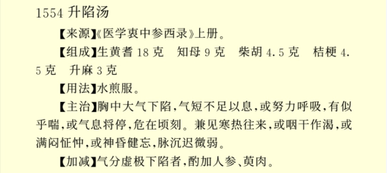
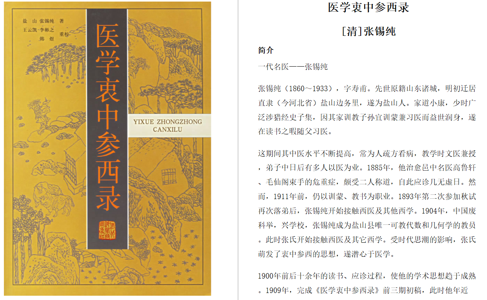
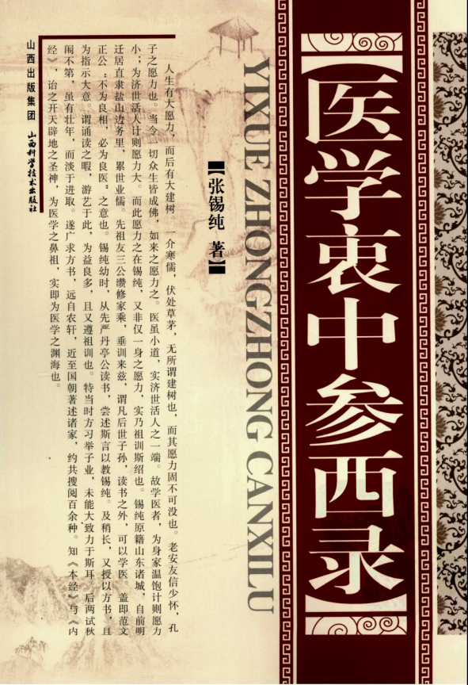

升陷汤

升陷汤
属性:治胸中大气下陷，气短不足以息。或努力呼吸，有似乎喘。或气息将停，危在顷刻。其兼证，或寒热往来，或咽干作渴，或满闷怔忡，或神昏健忘，种种病状，诚难悉数。其脉象沉迟微弱，关前尤甚。其剧者，或六脉不全，或参伍不调。
生箭（六钱）知母（三钱）柴胡（一钱五分）桔梗（一钱五分）升麻（一钱）气分虚极下陷者，酌加人参数钱，或再加山萸肉（去净核）数钱，以收敛气分之耗散，使升者不至复陷更佳。若大气下陷过甚，至少腹下坠，或更作疼者，宜将升麻改用钱半，或倍作二钱。
升陷汤，以黄为主者，因黄既善补气，又善升气。惟其性稍热，故以知母之凉润者济之。柴胡为少阳之药，能引大气之陷者自左上升。升麻为阳明之药，能引大气之陷者自右上升。桔梗为药中之舟楫，能载诸药之力上达胸中，故用之为向导也。至其气分虚极者，酌加人参，所以培气之本也。或更加萸肉，所以防气之涣也。至若少腹下坠或更作疼，其人之大气直陷至九渊，必需升麻之大力者，以升提之，故又加升麻五分或倍作二钱也。方中之用意如此，至随时活泼加减，尤在临证者之善变通耳。
附药方（来源医学衷中参西录）：

