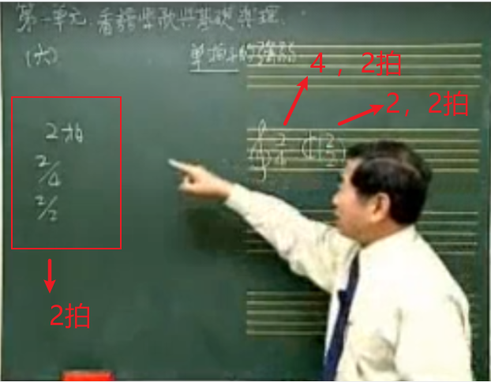
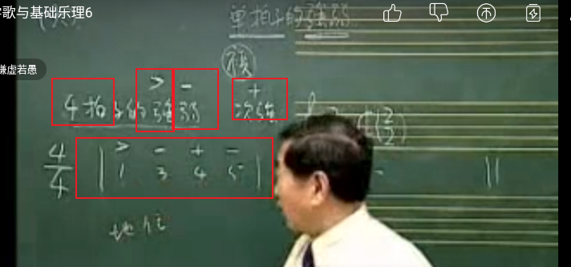
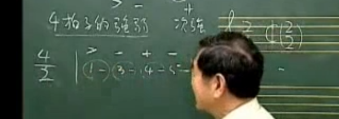
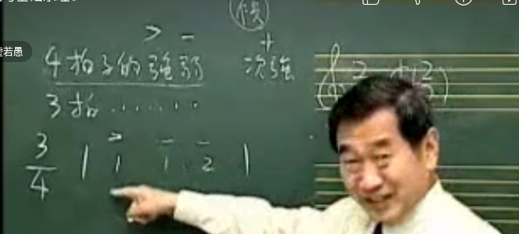
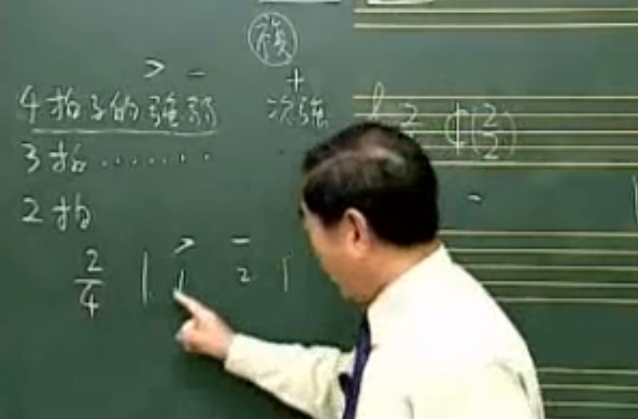

### 单拍子有哪些

### 2拍 2/4 2/2 都是2拍

图示

#### 3拍 3/4【4分音符当一拍，没小节有3拍】 3/2 3/8  都是3拍子，

#### 4拍 【有人当成复拍】 这里先当单拍子讲

#### | 小节线 说明每一拍的地位，也告诉节拍的强弱

#### 4 拍子的强弱

1. 强弱符号 如图
   
2. 以此类推 4/2 4/8 ……

#### 3拍子的强弱变化

1. 

2. 以此类推 3/2 3/8  ……

#### 2拍子的强弱变化

1. 

2. 以此类推 2/2 2/4 ……

3. 2拍的歌比较有精神，雄壮，进行曲，儿歌大都是2拍

#### 重要的字要放在强音上，强拍上

#### 