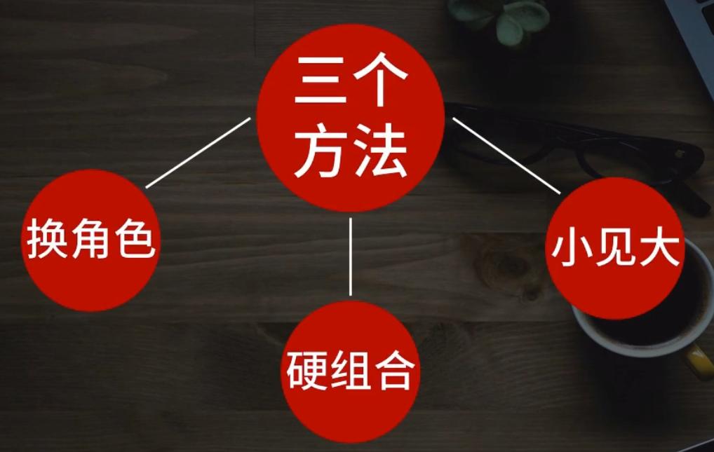

### 爆款文章写作方法及四大特点

#### 特点1

+ 爆款文章拆解
  
  + 1. 选题
    
    2. 标题
    
    3. 文章架构
    
    4. 开头
    
    5. 结尾
    
    6. 金句
    
    7. 故事 
       
       

#### 特点2 拿走即用 用就见效

针对7大部分

1. 文章模板

2. 7大金句模板

3. 9大标题模板

4. 8大开头模板

#### 特点3

写作练习

#### 特点4

7种写作赚钱方式

#### 用户思维

#### 选题

1. 写热点 通往10w加+

2. 快速达到是10w+套路

3. 套路一 将热点事件进行改编

4. 套路二 简单盘点和梳理事件

5. 套路三 复制粘贴最高赞的评论 比如微博最高赞  
   
   1. 微博高赞评论 网易云音乐高赞评论 知乎高赞评论 微信爆款文章下面评论，

6. 从事件争议点找角度

7. 新榜排行榜 

#### 爆款公式

#### 稳上10w+的公式

##### 100w+爆款文章的方法

1. 换角色
   + 换角度写， 不要写所有人都写的角度
     
2. 硬组合
   + 把不相关，或相反的事情组合在一起，形成反差
3. 以小见大
   + 描述大的事物时，可以使用比较具体，有代表性的东西来详细写，写细节，描写细节。
4. 收集选题方法
   

#### 标题

1. 三大误区
   
   1. 标题过长
   
   2. 标题信息量多，不聚焦
      
      + 聚焦在某一爆点上
   
   3. 标题完全概括文章内容 《最忌
   
   

2. 文章标题只有一个目的》吸引人打开

3. 起标题步骤
   
   1. 找敏感词    
      
      1. 找敏感词方法
         1. 微信指数
         2. 看看10w+文章
            
   
   2. 套入8个模板
   
   3. 模版
      
      1. 数字法：数字一定要夸张些，
         
         > “90%的人都被背叛过？“95后已经当领导了，你不会还月薪5000吧
         > 做对这5点，老板乖乖给你升职加薪
         > 微信这13个功能，检验一个人爱不爱你
      
      2. 对比法：
         
         > 你们在国外买sklI，老外在中国抢大宝。
         > 
         > 谁不是一边热爱生活，一边在不想活。
         > 
         > 你只想和我约炮，可我想陪你到老。
      
      3. 热词法
         
         > <mark>**三色幼儿园事件**</mark>：这个世界永远只有黑与白
      
      4. 疑问法：善于利用反常识
         
         > 《那个躲在厕所里吃饭的孩子，后来怎么样了？》
         > 
         > 《为什么现在的男生越来越恨嫁？》
         > 《2018年还剩100天，你过得怎么样？》
         > 
         > 你们真以为男生看不出绿茶姨？ 善于利用反常识
         > 
         > 为什么有人喜欢渣男？善于利用反常识
