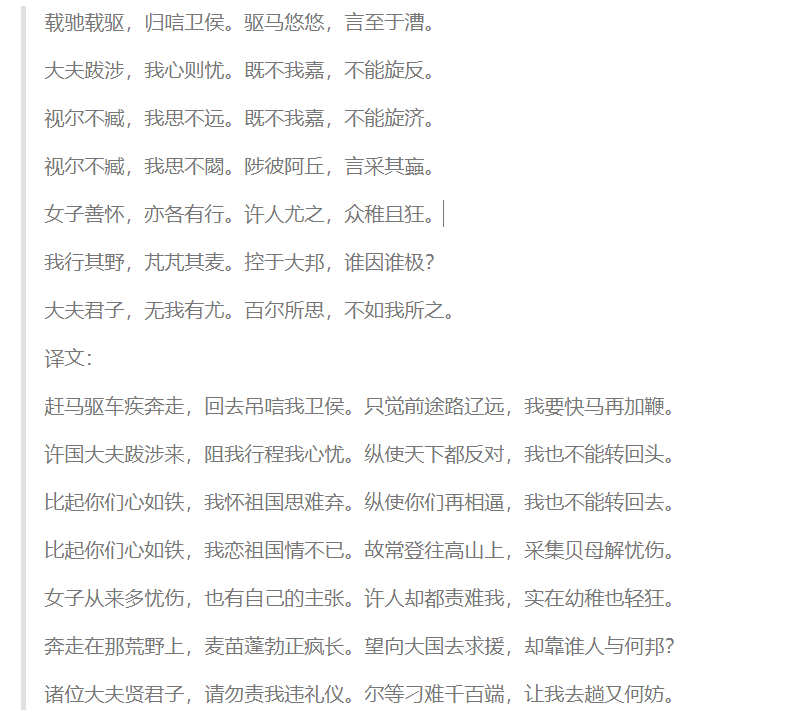

别再叫我爱国女诗人了

小女子本姓姬，母亲是当时齐国第一大美女宣姜，我也优良的遗传了母亲的基因。我母亲历经沧桑，是位很有故事的女人，用现在的话讲是趟过男人河的女人。不过她心底的疼，我是理解的，因为我也很有故事。

大家简单的叫我姬姑娘好了。

请别称呼我什么许穆夫人，虽然我真的是许穆公这老儿的妻子，其实我真实是不想嫁他的。无奈生于帝王家，我的婚姻只能由人摆布。这也就算了，最不能容忍的是，在我家乡（卫国）遭受戎狄践踏蹂躏之时（堪称春秋版”南京大屠杀“），他不但袖手旁观，作畏首畏尾的缩头乌龟，还阻止我去救我的家乡，生怕惹恼了蛮横的戎狄人，一点也没有男人样。假如我被戎狄夺取，估计他也连个屁都不敢放。当年为了娶我，给我家人送了那么多彩礼，家人见钱眼开，也不顾我的感受，就把我嫁了。嫁个有钱人，真的就幸福吗？现实证明，不过是个幸运的暴发户而已，事到临头才知道是个窝囊废。

也请别称呼我什么卫懿公的妹妹或者卫懿公的姑姑（有点乱，唉！我家真的有点儿理还乱的问题），打心眼里我也不想承认这位哥哥（或侄子），因为他不喜欢人，只喜欢禽兽，最爱的就是仙鹤，给鹤加官进爵，有鹤将军，鹤大夫，鹤夫人，并且这些官爵都是有俸禄的。鹤官员们出门，都要享受相应级别的待遇，譬如公车、譬如保卫等级，譬如交通管制等等。鹤夫人有自己的宫室，卫懿公还会临幸它们，做出些禽兽不如的事情来。玩物丧志说得就是他。虽然他被戎狄人碎尸了，也是他自找的，没人同情他。照比他带来的灾难而言，他一人死不足惜。

我远嫁他乡，当大风从我发间掠过的时候，有谁体会过我心底那浓浓的乡愁？我曾经美丽的家乡，我曾经眷恋的地方，沦落戎狄之手，有谁知道我的痛？如今我为复国积极奔走，也是仅仅是故乡的原风景在心底的呼唤。那山，那水，那人，承载着我曾经的点点滴滴，曾经的梦，我不允许别人毁坏他。即便毁坏，我也要重建他，不为别人，就是为了我自己心中的那个曾经……

曾经我嬉钓于淇水之旁，百泉之畔，“巧笑之瑳，佩玉之傩”，在那里我与小白邂逅，在那里我们欢笑，我们嬉闹，我们心许对方。我发誓要嫁给他，那里是见证我们爱的地方，是我梦开始的地方。岂能任人践踏？如今他已是齐桓公了，我要写信与他，告诉他我的处境，也许他能来帮我，即便不为我，也为我们的曾经，曾经淇水之畔的风景和那里的父老。

没想到，他真的来了，拯救了我的家乡，也拯救了我即将死去的心。我要感谢他，我要写诗，以我们卫国人的口吻写诗，不让他知道是我写的而牵挂……

投我以木瓜,报之以琼琚。匪报也,永以为好也。
投我以木桃,报之以琼瑶。匪报也,永以为好也。
投我以木李,报之以琼玖。匪报也,永以为好也。

