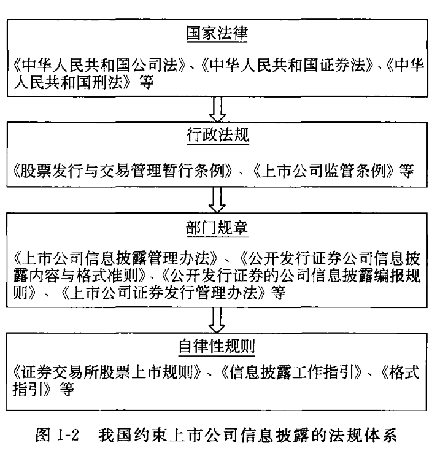

# 第一章 企业财务报表分析概论

## 第一节 企业利益相关者

1. 企业业主或股东
   + 定义:企业入资者或购买企业股票人。
   + 关注点:由于需要估计企业未来收益和风险水平，进而做出是否投资或保留既有投资
     - 企业的获利能力及投资风险方面
     - 持有公司股票市场价值
     - 公司现金流-因良好的现金流可以带来适度的股利分红
     - 由于大股东（控制性股东和重大影响行股东）影响企业重要岗位人事任免，投资经营及鼓励分配的决策，因此更关心企业战略行发展相关财务信息
       + 企业资产基本结构和质量
       + 企业资本几个
       + 企业长期获取质量较高利润等
     - 小股东（非控制性股东和非重大影响性股东）更关注
       + 企业近期业绩
       + 股利分配政策
       + 短期现金流转状况
2. 企业贷款提供者
   + 短期贷款者(12个月内)
     - 关注企业支付短期债务能力
   + 长期贷款者(12个月以上)
     - 关注利息和本金是否能按期清偿。由于长期获利能力及良好的现金流是偿还长期债务的保障，因此更关心长期持久的获利能力
3. 商品或劳务供应商
   + 以商品或劳务的形式成为企业的债权人，因此需要判断企业的支付商品或劳务的价款的能力
   + 大多数商品和劳务供应商关注短期偿债能力
   + 如果与企业存在长期持久稳固的经济关系，则关注长期偿债的能力
4. 企业管理人员
   + 受企业业主或股东委托，对企业业主或股东投入资本保值和增值负责。
   + 负责日志经营活动，确保公司支付股东与风险相适应的收益，及时偿还各种到期债务
   + 较高层次管理者关注财务状况较为全面
   + 较低管理者一般关注自己决策范围内的财务信息
5. 顾客
   + 由于企业多数为客户提供商品或劳务供应商，因此客户关心企业连续提供商品或劳务能力，所以客户比较关注企业长期的发展前景及有助于对此做出的估计获利能指标和财务杠杆指标等
6. 企业雇员
   + 由于对于工作岗位的稳定及环境的安全性和取得报酬的前景，因此对企业获利能力及偿债能力感兴趣
7. 政府管理部门
   + 全面所有制企业即为政府管理部门
   + 工商管理部门
   + 税务管理部门
   + 关注点
     - 获利能力
     - 偿债能力
     - 持续经营能力
8. 公众
   + 关注点 就业政策、环境政策、产品政策等
9. 竞争对手
   + 出于判断企业间的相对效率，也可能为未来可能出现企业兼并提供信息，竞争对手会关注企业的会计信息及其他各方面财务状况信息

#### 总结

1. 财务信息使用者所要求的信息大部分都是面向未来的
2. 不同的信息使用者各有不同的目的，因此，即使对待同一对象，他们所要求得到的信息也是不同的
3. 不同的信息使用者所需的信息的深度和广度不同
4. 企业财务报表中并不包含使用者所需要的所有信

#### 思维导图

[企业利益相关者.html](../../_resources/企业利益相关者.html)

## 第二节 企业财务报表的组成内容

### 企业财务报表[财务报告]

+ 基本财务报表 由企业会计部门提供的反映企业某一时期或时点财务状况与经营成果的书面文件
  
  - 资产负债表 balance sheet 是以资产=负责+所有者权益为平衡关系，反映企业在某一特定日期财务状况的报表
    
    1. 资产 是企业因过去的交易或事项所形成的并由企业拥有或控制，能以货币计量，预期会给企业带来经济利益的资源
       
       + 特征
         
         1. 是由过去的交易所获得——是否列为资产的标志
         2. 应能为企业所实际拥有或控制
            + 拥有 是指企业拥有资产的所有权
            + 控制 是指企业虽然没有某些资产的所有权，但是实际上可以自有支配和使用 如融资租入的固定资产
         3. 必须能以货币计量
            + 会计报表中列示的资产并非企业拥有的全部资产，只有能以货币计量的资源才能在报表上列示。会计报表资产<企业拥有资产
            + 如人力资源的，由于无法以货币计量，目前会计报表中并未计入
         4. 应能为企业带来未来经济利益，指未来直接或间接为未来的现金净流入做出贡献的能力
            + 可以是直接增加未来的现金流入
            + 可以是因耗用(如材料存货)或提供经济效用(如各种非流动资产的使用)而节约的未来的现金流出
       
       + 类别(按变现能力)
         
             1. 流动资产
             1. 非流动资产
    
    2. 债权
       
       + 是指企业由于过去的交易或事项形成的，预期会导致经济利益流出企业的现时义务
       + 特征
         1. 由企业过去的交易或事项引起
         2. 必须在未来的某个时点（且通常有确切的受款人和偿付日期）通过转让资产或提供劳务来清偿，即预期会导致经济利益流出企业
         3. 应是金额能够可靠的计量的债务责任
       + 分类 （按偿还期长短）
         1. 流动负债
         2. 非流动负债
    
    3. 其他权利
       
       + 所有者权益 （股东权益）
         1. 是指 企业资产扣除负债后由所有者享有的剩余权益
         2. 来源
            + 企业投资这对企业的投入资本
            + 直接计入所有者权益的利得和损失
            + 留存收益等
         3. 具体项目
            + 实收资本（或者股本）
            + 资本公积
            + 盈余公积
            + 和未分配利润等
  
  - 利润表 income statement 或profit and loss accounts
    
    + 反映企业某一会计期间财务成果的报表，可以提供企业在月度、季度、年度内净利润或亏损的形成情况
    + 收入-费用=利润
      1. 收入 
         - 指企业在日常活动中形成的、会导致所有者权益增加的、与所有者投入资本无关的经济利益的总流入
         - 收入只在经济利益很可能流入从而导致企业资产增加或者负债减少，且经济利益的流入额能够可靠计量时才能予以确认
         - 不包括为第三方或客户代收的款项
      2. 费用
         + 指企业日常活动中发生的、会导致所有者权益减少的、与向所有者分配利润无关的经济利益的总流出
         + 不同类型企业费用构成不同
           + 制造业
             1. 生产费用
                + 指与生产产品有关的各种费用
                + 包括
                  1. 直接材料费用
                  2. 直接人工费用
                  3. 间接制造费用
                + 上述费用应通过有关成本计算方法，归集、分配到各个成本计算对象，各成本计算对象的成本将从有关产品的销售收入中得到补偿
             2. 期间费用
                + 指那些与产品的生产无直接关系、与某一时期相联系的费用
                + 对制造业而言包括
                  1. 管理费用
                  2. 销售费用
                  3. 财务费用
                + 所得税费用
                  + 在会计利润与应税例如没有差异的条件下，所得税费用指企业按照当期应税利润与适用税率确定的应缴纳的所得税支出
  
  - 现金流量表 statement of cash flows 或cash flow statement
    
    - 是反映企业在一定会计期间现金流入与现金流出情况的报表
    - 这里现金指
      1. 货币资金
         + 库存现金
         + 银行存款
         + 其他货币资金等
      2. 现金等价物
         + 企业持有的期限短、流动性强、易于转换为已知金额现金、价值变动风险很小的投资
  
  - 所有者（股东）权益变动表 statement of changes in stockholder‘ equity
    
    - 是反映构成所有者权益的各个组成部分当期增减变动情况的报表

+ 报表附注
  
  + 是对资产负债表、利润表、现金流量表和所有者（股东）权益变动表等报表中列示项目的文字描述或明细资料，及对未能在这些报表中列示项目的说明等
  
  + 附注披露顺序
    
    1. 财务报表的编制基础
    2. 遵循《企业会计准则》的声明
    3. 重要会计政策的说明，包括财务报表项目的计量基础和会计政策的确定依据等
    4. 重要会计估计的说明，包括下一会计期间内很可能导致资产、负债账面价值重大调整的会计估计的确定依据等
    5. 会计政策和会计估计变更以及差错更正的说明
    6. 对已在资产负债表、利润表、现金流量表和所有者权益变动表中列示的重要项目的进一步说明，包括终止经营税后利润的金额及其构成情况等
    7. 或有和承诺事项、资产负债表日后非调整事项、关联方关系以及交易等需要说明的事项
  
  + 还应披露
    
    + 在资产负债表日后、财务报告批准报出日前提议或宣布发放的股利总额和每股股利金额（或投资者分配的利润总额）
    
    + 企业注册地、组织形式和总部地址
    
    + 企业的业务性质和主要经营活动
    
    + 母公司以及集团最终母公司的名称
      
      ### 思维导图

[企业财务报表的组成内容.html](../../_resources/企业财务报表的组成内容.html)

## 第三节 制约企业报表编制的基本会计假设

### 一、会计主体假设

1. 会计主体 （accounting entity）假设
   
   + 定义 是指每个企业的经济业务必须与企业的所有者及其他经济组织分开
   + 《企业会计准则-基本准则》中的表述 
     + 企业应当对其本身发生的交易或者事项进行确认、计量和报告
   + 作用
     1. 限定了企业会计活的的空间范围
     2. 对会计概念、会计行为、会计法律建设及报表编制等方面有重大影响

2. 持续经营（going concern）假设
   
   + 含义 是企业会计方法的选择应以企业在可预见的未来将以它实现的形式并按既定的目标持续不断的经营下去为假设。也就是说，企业在可预见的将来不会面临破产和清算。
   + 《企业会计准则-基本准则》表述：企业会计确认、计量和报告应当以持续经营为前提。
   + 为企业在编制报表时会计方法的选择奠定了基础，主要表现：
     1. 一般情况下，支持以其取得时的历史成本计价，而不安其立即进入解散、清算状态的现行市价计价
     2. 对长期资产摊销（如固定资产折旧，无形资产摊销等）问题的处理，均以企业在折旧年限或摊销期内会持续经营为假设
     3. 企业偿债能力的评估与分析也是基因企业在会计报告期后仍能持续经营的假设
     4. 正是由于考虑到持续经营假设才有了会计上除固定资产折旧与无形资产摊销以外其他权责发生制方法的选择
        + 坏账处理的备抵法
        + 销售收入的确认等
     5. 还要求当传统方法可能危及企业的持续经营时，企业的会计活动能选择对企业持续经营有利的方法 如
        + 在通胀下，简单的价值补偿不能维持其实物替换的持续经营时，力求在会计方法上消除，通胀的不利影响
        + 通胀下，存货计价采用后进先出法比较有利于持续经营等

3. 会计分期（accounting periods）假设
   
   + 含义 
     
     + 企业在持续经营过程中所发生的各种经济业务可以归属于人为划分的各个期间，这种因会计需要而划分的期间称为会计期间
   
   + 划分方式
     
     + 月
     
     + 季
     
     + 年
   
   + 《企业会计准则-基本准则》表述
     
     + 企业应当划分会计期间，分期结算账日和编制财务会计报告
   
   + 会计年度
     
     + 以年度划分的会计期间，可以用日历年度一致，也可不一致
     
     + 《企业会计准则-基本准则》规定 会计期间分为年度和中期
       
       + 中期 指短衣一个完整会计年度的报告期间

4. 货币计量（monetary measurement）假设
   
   + 含义 
     
     + 只有能用货币反映的经济活动，才能纳入会计系统
     
     + 第一 会计所计量和反映的，只是企业能用货币计量的方面
     
     + 第二不同实物形态的资产需用货币作为统一计量单位，才能据以进行会计处理，及时企业财务状况
     
     + 使得去企业对大量复杂的经济业务进行统一汇总、计量成为可能

## 第四节 制约企业报表编制的一般原则

### 基本会计原则

1. 客观性原则

   + 《企业会计准则-基本准则》客观性（objectivity）原则表述 是企业应当以实际发生的交易或者事项为依据进行会计确认、计量和报告，如实反映符合确认和计量要求的各项会计要是及其他相关信息，保证会计信息真实可靠，内容完整。

     + 两层含义

       1. 可验证性
          
          + 是指企业的会计处理应当尽量以实际发生的业务为基础，以取得的业务凭证为依据。
          
          + 作用 
            
            1. 保证企业的会计处理，从填制记账凭证、登记账簿到编制会计报表等过程都有可靠的凭证为依据
            
            2. 保证会计上账证、账账、账表和账实之间的相互一致

       2. 会计人员对某些会计事项的估计判断合法、合规、合理

          + 有些业务虽然已经发生，但是其金额需要靠会计人员的职业估计和判断才能确定，此类业务很难要求达到数据的准确性。

          + 诸如
            1. 固定资产
            2. 无形资产
            3. 递延资产的摊销
            4. 坏账损失的预先估计
            5. 制造费用在完工产品和产成品的分摊
            6. 或有损失的估计
          + 财务信息客观性标志
            + 如果两个人以上有资格的人员查证同样的数据时，基本上能得出相同的计量和结论

     

2. 相关性原则 

   + 含义
     + 相关性（relevance）原则 指企业所提供的会计信息应当与信息使用者相关，对信息使用者的决策有用。
     + 《企业会计准则——基本准则》相关性要求是 企业提供的会计信息应当与财务会计报告信息使用者的经济决策需要相关，有助于财务会计报告使用者对企业过去，现在或将来的情况做出评价或者预测。

3. 明晰性原则

   + 《企业会计准则——基本准则》对明晰性（clarity）原则表述
     + 企业提供的会计信息应当清晰明了，便于财务会计报告使用者理解和利用
     + 为确保会计信息符合客观原则，需要进行对会计信息及产生过程审查和验证 则需要
       1. 会计记录准确、清晰
       2. 会计凭证和账簿要据实填写和登记
       3. 账户对应关系清楚
       4. 文字摘要属实
       5. 手续齐备
       6. 程序合理

4. 可比性（comparability）原则

   + 含义 《企业会计准则——基本准则》企业提供的会计信息应当具有可比性
   + 要求
     1.  同一企业不同时期发生的相同或者相似的交易或者事项，应当采用一致的会计政策，不得随意变更。确需变更的，应当附注中予以说明。
     2. 不同企业发生的相同或者相似的交易或者事项，应当采用规定的会计政策，以确保会计信息口径一致，相互可比
   + 作用
     + 可使企业连续几个会计期间的会计信息对经营决策有使用价值
     + 使不同会计期间的会计报表和会计信息进行纵向分析对比
     + 防止个别企业或个别人利用会计方法的变动，人为操纵体现企业财务状况的指标如成本、利润等以粉饰企业财务状况和财务成果
     + 不同企业，特别是同一行业的，应当采用规定的会计政策，以使不同企业的会计报表编制建立在相同基础上，利于使用者分析比较

5. 实质重于形式原则

   + 含义 实质重于形式（substance over form）企业应按照交易或事项的经济实质进行会计确认、计量和报告，不应仅以交易或者事项的法律形式为依据

6. 重要性（materiality）原则

   + 《企业会计准则——基本准则》要求企业提供的会计信息应当反映与企业财务状况、经营成果和现金流量等有关的所有重要交易和事项
   + 主要表现
     1. 对某些经济业务，因其金额或数量较小，如不予以单独反映对揭示企业的财务状况也不至于产生重大影响，因而在处理时采取与其他项目合并，以突出其他重要性项目的做法。

7. 谨慎（prudence）原则

   + 《企业会计准则——基本准则》表述是，企业对交易或者事项进行确认、计量和报告应当保持应有的谨慎，不应该高估资产或者收益、低估负债或者费用
   + 又称稳健性原则 
     + 指在企业不确定的经济业务进行处理时，应持保守态度
     + 具体说就是凡是可以预见的损失和费用均应予以确认，而对不确定的收入不予确认
   + 采取原则的方面有
     + 对各种质量下降的资产计提减值准备
     + 对企业进行预计负债的账务处理
     + 对部分固定资产可以采用加速折旧法等

8. 及时性（timeliness）原则

   + 《企业会计准则——基本准则》表述： 企业对于已经发生的交易或者事项，应当及时进行确认、计量和报告，不得提前或者延后。
   + 包含两方面含义
     + 在企业经济活动发生以后，会计人员应对其进行及时的会计处理，将其纳入会计系统
     + 在会计期间结束后，应能及时地编制财务报告，使有关利害相关者能够及时地了解企业财务状况的最新变化情况
     + 以上两方面是相互联系的

9. 权责发生制（accrual basis）原则

   + 又称应计制原则
   + 基本含义
     + 凡属于本会计期间的收入和费用，不论其款项是否收付，均应作为本期的收入和费用处理；
     + 凡不属于本期的收入和费用，即使其款项已在本期收取或付出，也不作为本期的收入和费用处理。
   + 本期的收入-也称已实现的收入
     + 以实现收入的过程是否完成为关注点
     + 并不关注货币的收取情况
     + 只要商品销售的过程完成或收入的赚取过程完成，会计上就确认为收入
     + 一般，企业会计上所确认的收入（体现为利润表中引起利润增加的因素）与货币收款情况有三种对应关系
       1. 在销售活动完成或劳务提供过程完成时立即收取货款（如现销），使得收入的确认引起货币同时增加
       2. 在销售活动完结或提供过程完结时并不立即收取货款（部分或全部），但却取得在未来确定的时间内收取货款的权利（如赊销），使得收入的确认引起债权增加
       3. 在向顾客提供商品和劳务以前已经收取了货币（预收款销售），此时收入的确认引起债务减少
   + 本期的费用
     + 也称发生的费用
     + 是指为产生一定会计期间的收入而发生的耗费，在利润表中表现为使利润减少的因素
     + 其关注点在资源的消耗与实现收入的过程是否
     + 一般，企业会计上所确认的费用（体现为利润表各项费用等）与货币支付情况有三种关系
       1. 在费用发生时立即支付货款（小额的费用开支），使得费用的确认引起货币同时减少
       2. 在费用发生时并不立即支付款项（部分或全部），但却承担在未来确定的时间内支付款项的义务（如先耗用他人资源，后付款），使得费用的确引起债务增加
       3. 在费用发生以前已经对有关资源的取得进行了支付（如先付款购买，后耗用的资源），此时费用的确认引起非货币资产的减少。

## 第五节 制约企业财务报表编制的法规体系

### 1. 《中华人们共和国会计法》

### 2. 《企业会计准则体系》

1. 基本会计准则
2. 具体会计准则
   1. 一般业务处理准则
   2. 特殊行业会计准则
   3. 特定业务准则
3. 会计准则应用指南和解释公告

## 第六节 上市公司的信息披露制度

1. 信息披露制度 也称 公示制度 或公开披露制度

2. 是上市公司为保障投资者利益，接受社会公众的监督而依照法律规定必须将其自身的财务变化、经营状况等信息和资料向证券管理部门和证券交易所报告，并向省会公开或公告，以便使投资者充分了解情况的制度

3. 主要分两类

   1. 投资者评估公司状况所需要的信息
   2. 对股价运行有重要影响的事项

4. 从披露时段来看

   1. 上市前会计信息
   2. 上市后会计信息

5. 上市公司信息披露规范体系构成

   1. 证券发行信息披露制度
      1. 招股说明书
      2. 上市公告书
   2. 持续性信息披露制度（定期报告制度和临时报告制度）
      1. 年度报告
      2. 中期报告（包括半年度报告和季度报告）
      3. 临时报告（包括重大事件公告和收购与合并公告）
   3. 披露的法规体系包括
   
   

