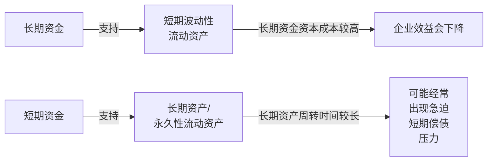
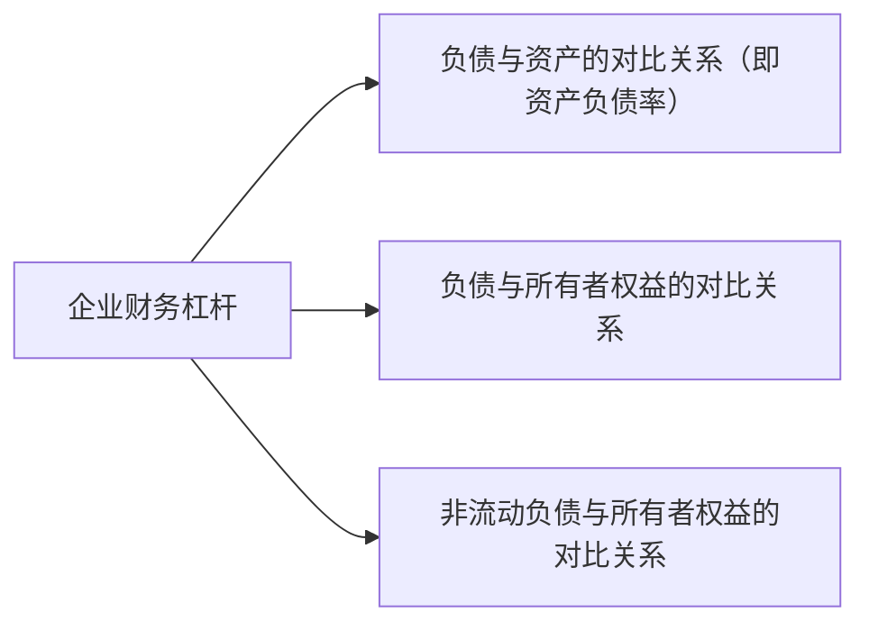
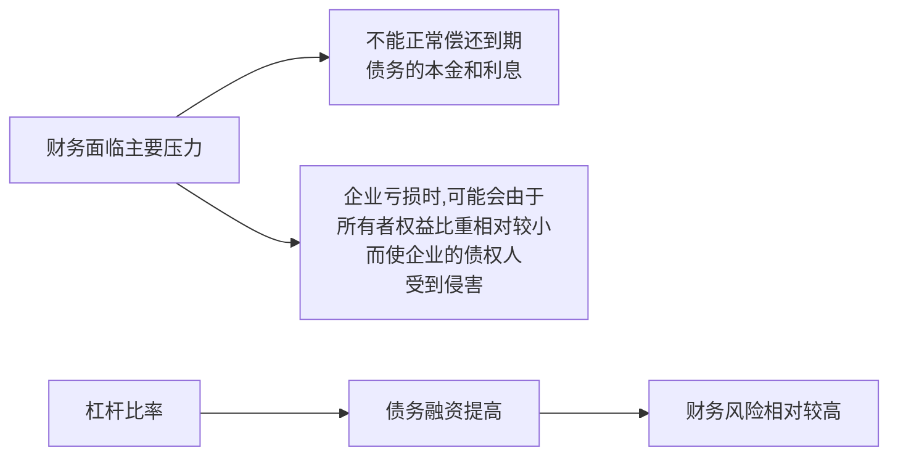
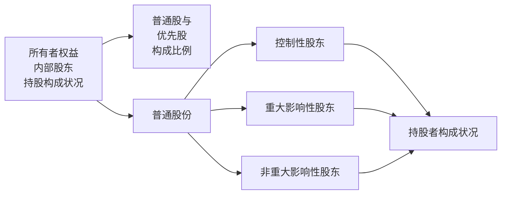
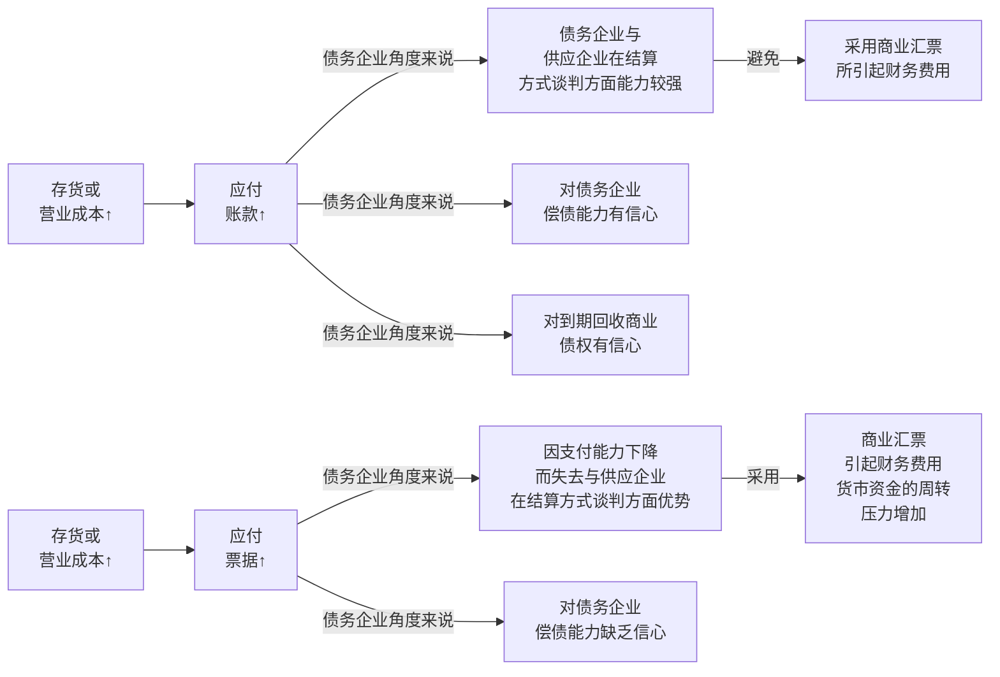
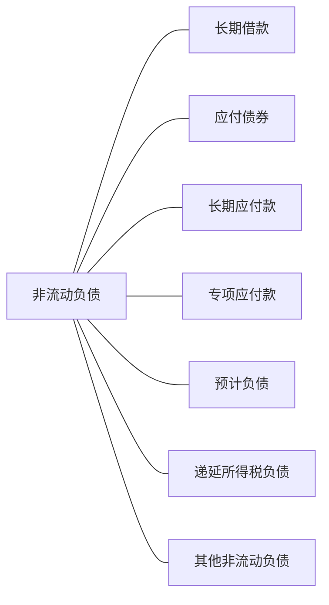

## 第一节 资本结构与资本结构质量分析理论

### 一、资本结构（capital structure）

+ 资本结构所包含的主要范围
  
  + （一）股权结构
    
    + 将资本结构理解为股权结构,有助于信息使用者将关注点导向企业财务资源的主要来源之一———股东人资的结构方面。
  
  + （二）有代价的企业财务资源的来源结构
    
    + 有代价的企业财务资源的来源结构主要是指企业所有者(股东)权益与贷款（也包括融资租赁固定资产引起的负债)的结构和数量对比关系。将资本结构理解为有代价的企业财务资源的来源结构,有助于信息使用者将关注点导向资本成本以及融资渠道的选择等方面。
  
  + （三）企业资产负债表右方“负债与所有者权益”的结构
    
    + 在将企业的资本结构理解为企业资产负债表右方“负债与所有者权益”的结构的条件下，资本结构
      
      + 既包括企业负债总规模与所有者权益规模的对比关系，
      
      + 也包括企业各类债务(如短期债务、长期债务)占总负债的构成比例
      
      + 和所有者权益中各类股东的持股构成比例，
      
      + 以及所有者权益中各项目的构成比例。
      
      + 这种理解有助于信息使用者将关注点导向企业财务资源对负债的依赖状况。

### 二、资本结构质量分析理论

+ 资本结构质量
  
  + 是指企业资本结构与企业当前以及未来经营和发展活动相适应的程度。

+ 具体来说，企业资本结构质量主要应关注几个主要方面
  
  + 第一，企业资本成本的水平与企业资产报酬率的对比关系；
    
    + 一般来说，资本成本是指企业取得和使用资本所付出的代价，
      
      + 主要包括筹资过程中的**筹资费用**和使用过程中的**使用费用**。
        
        + <mark>筹资费用</mark>
          
          + 是指企业获取资金来源（如发行债券、股票以及其他筹资方式)过程中发生的申请、登记、印刷等费用；
        
        + <mark>使用费用</mark>
          
          + 是指企业在一定时期内因使用资金而支付给资金提供者的报酬，如利息、股利等
    
    + 企业的资本成本
      
      + 是指企业的负债成本与股东人资成本的加权平均成本。
    
    + 当企业的资产报酬率
      
      + 应当为企业的利息和税前利润与企业总资产之比
    
    + 资产报酬率  > 加权平均资本成本时，企业向资金提供者支付报酬以后使企业的净资产得到增加，企业净资产的规模得以扩大；
    
    + 资产报酬率 < 加权平均资本成本时，企业在向资金提供者支付报酬以后，将缩减企业的净资产，企业净资产的规模将逐渐缩小。
      在这种情况下，我们只能认为企业的资本结构质量较差。
  
  + 第二，企业资金来源的期限构成与企业资产结构的适应性;
    
    + 从期限构成的角度来看，
      
      + 企业资金来源中的<mark>所有者权益部分</mark>，在有限责任公司的条件下，都属于永久性资金来源。
      
      + 企业资金来源中的<mark>负债部分</mark>，则有<mark>流动负债与非流动负债</mark>之分。
    
    + 按照财务管理理论，企业筹集资金的用途，决定筹集资金的类型：
      
      + 企业增加永久性流动资产或增加长期资产，应当通过长期资金来源（包括所有者权益和非流动负债）来解决；
      
      + 企业由于季节性、临时性原因造成的流动资产中的波动部分，则应由短期资金来源来解决。
      
      + 如果企业的资金来源不能与资金的用途相配比，在用长期资金来源来支持短期波动性流动资产的情形下，由于企业长期资金来源的资本成本相对较高，企业的效益将会下降；在企业用短期资金来源来支持长期资产和永久性流动资产的情形下，由于企业的长期资产和永久性流动资产的周转时间相对较长，企业可能会经常出现急迫的短期偿债的压力。
      
      + 图1

+ 这就是说，企业资金来源的期限构成与企业资产结构相适应时，笔者认为企业的资本结构质量较好；反之，企业的资本结构质量较差。

+     图1

+ 需要注意的是，某些企业因为战略发展的需要，往往会出现资金来源的期限和企业资产结构不适应，此时应该根据具体情况进行动态的分析，不能轻易地下结论。

+ 第三，企业的财务杠杆状况与企业财务风险、企业的财务杠杆状况与企业未来融资要求以及企业未来发展的适应性；
  
  + 企业的财务杠杆，一般可以表现为三种关系，
    
    + 负债与资产的对比关系（即资产负债率）、
    
    + 负债与所有者权益的对比关系、
    
    + 非流动负债与所有者权益的对比关系。

+ 实际上，上述<mark>三种关系所表现的实质内容是一致的</mark>，即表现在形成企业资产的财务来源中，<mark>负债所占有的相对规模</mark>。

+ 按照一般的财务管理理论，企业财务杠杆比率越高，表明企业资源对负债的依赖程度越大。

+ 在企业过高的财务杠杆比率的条件下，企业在财务上将面临两个主要压力：
  
  + 一是不能正常偿还到期债务的本金和利息；
  
  + 二是在企业发生亏损的时候，可能会由于所有者权益的比重相对较小而使企业的债权人受到侵害。受此影响，企业从潜在的债权人那里获得资金的难度会大大提高。
  
  + 这就是说，企业在未来进行债务融资以满足未来正常经营与发展的难度会因企业较高的杠杆比率而提高。因此，较高财务杠杆比率的企业，其财务风险相对较高。
  
  +

+ 

+ 第四，企业所有者权益内部的股东持股构成状况与企业未来发展的适应性。
  
  + 企业所有者权益内部的股东持股构成状况，主要是指两个方面：
    
    + 一是指在企业的所有者权益的结构中，普通股与优先股的构成比例；
    
    + 二是指在企业的普通股份的构成中，控制性股东、重大影响性股东和非重大影响性股东的持股者的构成状况。
    
    + 由于优先股一般没有表决权，因而在下面的讨论中，将主要针对第二种股东构成进行讨论。
    
    + 按照企业股权持有者对企业的影响程度，一般可以将企业的股东分为
      
      + 控制性股东、
        
        + 控制性股东将有权决定一个企业的财务和经营政策
      
      + 重大影响性股东
        
        + 对一个企业的财务和经营政策有参与决策的权利，但并不决定这些政策；
      
      + 非重大影响性股东三类
        
        + 对被持股企业的财务和经营政策几乎没有什么影响
      
      + <mark>控制性股东、重大影响性股东将决定企业未来的发展方向</mark>。因此，在对企业的资本结构进行分析时，必须关注企业的控制性股东、重大影响性股东的背景状况.

## 第二节 流动负债质量分析

#### 负债含义

+ 是指企业在某一特定日期承担的、过去的交易或者事项形成的、预期会导致经济利益流出企业的现时义务。

+ 按照会计的历史成本原则，负债
  
  + 仅限于那些企业承担的过去或现在已完成的经济业务所引起的、可以用货币计量的未来的经济责任。

+ 这里所指的义务包括法定义务和推定义务。
  
  + 法定义务，
    
    + 通常是指企业在经济管理和经济协调中，依照经济法律、法规的规定必须行的责任。
  
  + 推定义务，
    
    + 通常是指企业在特定情况下产生的或推断出的责任。

+ 在会计上，负债按其偿还期的长短分为
  
  + 流动负债（current liabilities）
    
    + 流动负债是指将在1年（含1年）或超过1年的一个营业周期内偿还的债务。各项流动负债按实际发生额记账。
  
  + 非流动负债（non-currentliabilities)。
  
  + 非流动负债是指偿还期在1年或超过1年的一个营业周期以上的债务。与流动负债相比，非流动负债具有金额较大、偿还期限较长的特点。

#### 一、流动负债的构成

+ 企业的流动负债，是指那些在1年以内应该偿还的债务，
  
  + 包括
    
    + 短期借款 （short-term loans)
      
      + 反映企业借人尚未归还的1年期以下（含1年)的借款 包括
        
        + 流动资金借款、
        
        + 结算借款、
        
        + 票据贴现借款，
        
        + 以及企业借人的借款期在1年或长于1年的一个经营周期以内的新产品试制借款、
        
        + 引进和技术借款、
        
        + 进口原材料短期外汇借款等。
      
      + 其利息费用作为企业的财务费用,计人当期损益。
    
    + 交易性金融负债（tradable financial liabilities)
      
      + 反映企业承担的以公允价值计量且其变动计人当期损益的为交易目的所持有的金融负债。
    
    + 应付票据（notes payable)
      
      + 反映企业购买材料、商品和接受劳务供应等而开出并承兑的、尚未到期付款的商业汇票,包括
        
        + 银行承兑汇票
        
        + 商业承兑汇票
      
      + 商业汇票规定有一定的承兑期限(最长不超过6个月)，在承兑期限内由交易双方商定具体承付日期。
      
      + 如果是分期付款，则应一次签发若干张不同期限的汇票。
    
    + 应付账款（accounts payable)
      
      + 反映企业购买原材料、商品和接受劳务供应等而应付给供应单位的款项。它是由于购进商品或接受劳务等业务发生时间与付款时间不一致造成的。
      
      + 一般来说，凡是购进商品的所有权转到企业(买方企业)时，或企业实际使用外界提供的劳务时，就需要确认应付账款并予以入账。
    
    + 预收账款（unearned revenue)
      
      + 项目反映企业按合同规定预收的款项。
      
      + 例如，
        
        + 收到销货订单时同时收取的保证金、
        
        + 预收报纸杂志的订费、
        
        + 预收商品包装物上的押金、
        
        + 长期建筑合同开出发票超过成本部分的金额等。
      
      + 它需在收款后1年或长于1年的一个营业周期内用约定的商品、劳务或出租资产来抵偿。如果企业收取款项后，没有按照约定的条件提供商品
        或劳务，就必须退还预收款项并赔偿由此给客户造成的损失。
      
      + 预收收入一般被列为流动负债，
      
      + 如果有特别合约规定，企业预收款项可在1年或长于1年的一个营业周期以上用提供商品、劳务来清偿，则应列为非流动负债
    
    + 应付职工薪酬（employee benefits payable)
      
      + 反映企业根据有关规定应付给职工的工资、职工福利、社会保险费、住房公积金、工会经费、职工教育经费、非货币性福利、辞退福利等各种薪酬。
    
    + 应交税费（taxes and dues payable)
      
      + 反映企业按照税法规定计算的应缴纳的各种税费，包括
        
        + 增值税、消费税、营业税、所得税、资源税、土地增值税、城市维护建设税、房产税、土地使用税、车船使用税、教育费附加、矿产资源补偿费，以及企业代扣代缴的个人所得税等。
        
        + 企业所缴纳的税金不需要预计应交数的，如印花税、耕地占用税等，则不在本项目
          列示。
    
    + 应付利息（interest payable)
      
      + 反映企业按照规定应当支付的利息，
      
      + 包括
        
        + 分期付息到期还本的长期借款应支付的利息、
        
        + 企业发行的企业债券应支付的利息等。
    
    + 应付股利（dividends payable)
      
      + 反映企业已作宣告但尚未支付的现金股利或利润。
    
    + 其他应付款（other payables)
      
      + 反映企业所有应付和暂收其他单位和个人的款项，如应付租人固定资产的租金、包装物的租金、应付保险费、存人保证金、应付统筹退休金等。
    
    + 1年内到期的非流动负债(non-current liabilities due within one year)
      
      + 反映企业各种非流动负债在1年之内到期的金额,包括
        
        + 1年内到期的长期借款、
        
        + 长期应付款
        
        + 应付债券。
    
    + 及其他流动负债等项目（other current liabilities)
      
      + 反映企业除上述流动负债以外的其他流动负债。

#### 二、流动负债质量分析

+ 流动资产是1年内可变现为货币的资产项目，

+ 流动负债为1年内应清偿的债务责任。

+ 因此，在任一时点上，两者的数量对比关系对企业的短期经营活动均会产生十
  分重要的影响。

+ 此外，流动负债各构成项目的流动性、可控制程度等对企业短期经营亦有
  着很大的影响。

+ 对流动负债的质量分析，主要应关注以下几个主要方面。
  
  + （一）流动负债周转分析
    
    + 流动负债各个构成项自的周转期间并不一致。
    
    + 有的项自流动性较高，在1年内甚至更短的时期内就要进行偿付（如短期借款一般都会在1年内得到偿付）；
    
    + 有的项自流动性较低，在很长的时间甚至超过1年或超过1年的一个营业周期以上的时间内进行清偿，如一些与关联企业往来结算而形成的其他应付款项。
    
    + 判断一个企业的流动性风险时，应该对流动负债内部成分按照流动性进行区分与分析。流动性较差的短期负债会在无形中降低企业的流动性风险。否则会高估企业的流动性风险。
    
    + 应该特别注意<mark>应付票据</mark>与<mark>应付账款</mark>的规模变化及其与<mark>企业存货规模变化</mark>之间的关系。在企业存货规模增加较大，而同时企业应付票据与应付账款的规模也增长较快的情况下，这种应付票据与应付账款的规模增加可能在很大程度上代表了企业供应商的债权风险
  
  + （二）非强制性流动负债分析
    
    + 对于企业短期偿债能力来说，能够真正影响企业现实偿债能力的是那些强制性的债务，如当期必须支付的应付票据、应付账款、银行借款、应付股利以及契约性负债等。
    
    + 对于预收账款、部分应付账款、其他应付款等，由于某些因素的影响，不必当期偿付，实际上并不构成对企业短期付款的压力，属于非强制性债务。
  
  + （三）企业短期贷款规模可能包含的融资质量信息
    
    + 一般来说，短期贷款主要与企业的经营活动相联，通常用于补充企业的流动资金。
    
    + 但是，在实践中，企业资产负债表期末短期借款的规模可能表现为远远超过实际需求数量(<mark>通过比较短期借款与货币资金的数量关系来观察</mark>）。
    
    + 原因可能涉及：
      
      + 第一，企业的货市资金中，包含了一部分由银行承兑汇票引起的保证金(通常按照应付票据的一定百分比确定）。
      
      + 第二，企业由于组织结构的原因，存在众多异地分公司。分公司的货币资金由各个分公司支配，汇集到一起在报表上表现出的规模并不能代表企业实际可支配的货市规模。
      
      + 第三，由于融资环境和融资行为的原因，企业融人了过多的货市资金，等等。
        在由于融资环境和融资行为的原因而导致企业融人了过多的货市资金的条件下，过高的短期借款规模将会引起企业不必要的财务费用并支。
  
  + （四）企业应付票据与应付账款的数量变化所包含的经营质量信息
    
    + 一般认为，应付票据和应付账款的相对规模代表了企业利用商业推动其经营活动的能力，同时也可反映出企业相对于供应商的议价能力。
    
    + 由于应付票据和应付账款的财务成本并不相同(在我国的商业汇票普遍采用银行承兑的条件下，应付票据是有成本的)，从企业应付票据和应付账款，的数量变化中可以透视出企业的经营质量
      
      + 1.随着企业存货或营业成本的增长,应付账款相应增长在随着企业存货或营业成本的增长，应付账款相应增长的情况下，从债务企业角度来说，这种增长在很大程度上代表了债务企业与供应企业在结算方式的谈判方面具有较强的能力：企业成功地利用了商业信用来支持自己的经营活动，又避免了采用商业汇票结算所可能引起的财务费用。从债务企业角度来说，之所以接受这种结算方式而不采用商业汇票结算方式，是因为对债务企业的偿债能力有信心，对到期回收商业债权有信心。
      
      + 2.随着企业存货或营业成本的增长,应付票据相应增长在随着企业存货或营业成本的增长，应付票据(我国企业普遍采用银行承兑汇票)相应
        增长的情况下，从债务企业角度来说，这种增长在很大程度上代表了债务企业处于因支付能力下降而失去与供应企业在结算方式的谈判方面的优势而不得不采用商业汇票结算的境地。同时，采用商业汇票结算,不可避免地会引起财务费用的增加、货市资金的周转压力增加。从债务企业角度来说，之所以只接受商业汇票结算方式，除了在商业汇票具有更强的流动性外，还可能是因为对债务企业的偿债能力缺乏信心。

+ （五）企业税金交纳情况与税务环境
  
  + 如果企业的应交所得税、递延所得税负债表现为增加的态势，表明在纳税方面有可以允许企业推迟交纳税款的相对有利的税务环境。

## 第三节 非流动负债质量分析

#### 定义

+ 非流动负债是指1年以上偿还的债务，

+ 包括长期借款、应付债券、长期应付款、专项应付款、预计负债、递延所得税负债及其他非流动负债等

#### 一、非流动负债的构成

1. 长期借款（long-term loans)
   
   + 反映企业向银行或其他金融机构借人的尚未归还的期限在1年期以上（不含1年)的各期借款。
   
   + 一般用于企业的固定资产购建、固定资产改扩建工程、固定资产大修理工程以及流动资产的正常需要等方面，如目前的大修理借款、更新改造借款、小型技术借款、出口工业品生产专项借款、进口设备人民市借款等。
   
   + 按其偿还方式不同，
     
     + 可分为定期偿还的长期借款
       
       + 指在规定的借款到期日一次还清本金的借款
     
     + 分期偿还的长期借款。
       
       + 指在借款期限内，分期偿还本息，至到期日全部还清的借款。
   
   + 资产负债表中长期借款项目反映的是企业尚未归还的长期借款本金和利息。

2. 应付债券（debentures payable)
   
   - 反映企业为筹集长期资金而发行的债券本金和利息。
   
   - 同增发股票相比，当投资报酬率大于债券利率时，发行公司债券可以为股东带来较大的经济利益；而且因为公司债券的利息支出属于正常经营过程中发生的财务费用，可以用于抵免所得税。
     需要注意的是，如果公司债券利率高于企业投资报酬率，则利息费用将成为企业的沉重负担
   
   - 不论企业债券是按溢价还是接折价发行，应付债券均以实际收到的款项人账（但要分为面值和利息调整两个项自分别进行核算）。

3. 长期应付款（long-term payable)
   
   - 反映企业除长期借款、应付债券以外的各种长期应付款项，包括
     
     - 应付融资租入固定资产的租赁费
       
       - 企业采用融资租赁方式租入固定资产，应在租赁期开始日，将租赁开始日租赁资产公允价值与最低租赁付款额现值两者中较低者，加上初始直接费用，作为租入资产的人账价值，同时确认长期应付款。融资租赁实质上是分期付款购置固定资产的一种形式。
     
     - 以分期付款方式购入固定资产发生的应付款项等。
   
   - 企业购买资产有可能延期支付有关价款。如果延期支付的购买价款超过正常信用条件，实质上具有融资性质的，所购资产的成本应当以延期支付购买价款的现值为基础确定，并相应确认长期应付款。

4. 专项应付款（special payable)
   
   - 反映企业取得政府作为企业所有者投人的具有专项或特殊用途的款项，如专项用于技术革新、技术研究等。

5. 预计负债（estimated liabilities)
   
   - 反映企业确认的对外提供担保、未决诉讼产品质量保证、重组义务、亏损性合同等很可能产生的负债。
   
   - 如果与或有事项有关的义务同时符合以下条件，企业应将其确认为负债，并在资产负债表中以预计负债单独反映：
     
     - 第一，该义务是企业承担的现时义务;
     
     - 第二，该义务的履行很可能导致经济利益流出企业；
     
     - 第三，该义务的金额能够可靠地计量。其中，“很可能”指发生的可能性为“大于 50％但小于或等于95％”。

6. 递延所得税负债（deferred income tax liabilities)
   
   - 反映企业确认的应纳税暂时性差异产生的所得税负债。

7- 其他非流动负债(other non-current liabilities)

- 是指企业除长期借款、应付债券、长期应付款和专项应付款等负债以外的其他非流动负债。

#### 二、非流动负债费用的归属

- 即非流动负债产生的利息、汇兑损益等是归属于发生当期的费用还是予以资本化的问题。

- 非流动负债费用资本化
  
  - 是指有关负债费用在会计处理上将其作为购建某些资产的历史成本的一部分。

- 按照《企业会计准则第17号——---借款费用》的规定，企业发生的借款费用，可直接归属于符合资本化条件的资产的购建或者生产的，应当予以资本化，计人相关资产成本

- 其他借款费用，应当在发生时根据其发生额确认为费用，计人当期损益。

- “符合资本化条件的资产”，是指需要经过相当长时间的购建或者生产活动才能
  达到可使用或者可销售状态的资产，
  
  - 包括固定资产
  
  - 和需要经过相当长时间的购建或者生产活动才能达到可使用或可销售状态的存货
  
  - 投资性房产等。

#### 三、非流动负债的质量分析

- 按照财务理论，企业的非流动负债，应该是形成企业的<mark>非流动资产和短期资产（流动资产)中长期稳定部分的资金来源</mark>。这就是说，企业的非流动负债,可能形成了企业的固定资产、无形资产、长期股权投资，也可能形成了企业的经营性流动资产。此外,预计负债中的水分”也会对企业财务状况质量有重要影响。

- 企业非流动负债的质量分析，应该关注以下几个方面
  
  - （一）企业非流动负债所形成的固定资产、无形资产的利用状况与增量效益
    
    - 企业的非流动负债是有代价的财务来源
    
    - 而非流动负债所形成的固定资产、无形资产又是为企业的经营活动创造条件的
    
    - 因此，在财务关系上，就要求企业非流动负债所形成的固定资产、无形资产必须得到充分利用，并产生相应的增量效益。只有这样，企业的非流动负债才能够形成良性周转
    
    - 1. 企业非流动负债所形成的固定资产、无形资产必须得到充分利用
         
         - 得不到充分利用的固定资产和无形资产，即使其物理质量很高、取得成本很高，但由于其利用率不高而使其难以产生应有的财务效益。
      
      2. 企业非流动负债所形成的固定资产、无形资产必须产生增量效益
         较高的利用率并不一定能够自动产生增量财务效益。这是因为，固定资产和无形资产的利用虽然可推动企业营业收入的增长，但企业的效益是收入减去各种成本费用的结果。
  
  - （二）企业非流动负债所形成的长期股权投资的效益及其质量
    
    - 在企业<mark>的长期股权投资靠非</mark>流动负债来推动的条件下，企业的<mark>长期股权投资必</mark>须产<mark>生投资收益</mark>，<mark>且投资收益应该对应相当规模的货币回收</mark>。这样，非流动负债的本金和利息才有可能得以偿还，
  
  - （三）企业非流动负债所对应的流动资产及其质量
    
    - 某些时候，企业的非流动负债被用于<mark>补充流动资金</mark>，从而<mark>形成流动资产</mark>。在这种情况下，<mark>相应流动资产的质量将直接决定企业非流动负债的偿还状况</mark>。应该特别关注的是，
      <mark>企业的流动资产中有无不良占用</mark>(典型性的不良占用包括<mark>非正常其他应收款</mark>、呆滞债权和积压、周转缓慢的存货等）。
  
  - (四）预计负债分析
    
    - 一项<mark>或有事项是否会被确认为负债</mark>，在很大的程度上是<mark>人为的主观判断</mark>，这样就不<mark>可避免地会出现有的企业利用该项目来进行利润操纵的</mark>现象。是否具有利用预计负债操纵<mark>利润的嫌疑，要根据财务报告中的其他资料以及企业历史资</mark>料进行判断。

## 第四节 或有负债质量分析

#### 或有负债(contingent liabilities)

- 这类负债的债务金额大小、债权人以及付款日期的确定均取决于未来不确定事项的发生情况。

- 不在资产负债表中体现，但是必须在报表附注中披露

#### 一、或有负债的定义和种类

- 定义
  
  - 是指过去的交易或事项形成的潜在义务，其存在须通过未来不确定事项的发生或不发生子以确认;或过去的交易或事项形成的现时义务，履行该义务不是很可能导致经济利益流出企业或该义务的金额不能可靠地计量。

- 特征
  
  - （1）或有负债由过去的交易或事项产生。企业现在计划在未来某个时点购人一批原材料可能须承担支付货款的义务则<mark>不属于或有负债</mark>。
  
  - （2）或有负债的结果具有不确定性。或有负债包括两类义务，
    
    - 一类是潜在义务
      
      - 其结果如何只能由未来不确定事项的发生或不发生来证实
    
    - 另一类是特殊的现时义务
      
      - 其特殊之处在于：该现时义务的履行不是很可能导致经济利益流出企业，或者该现时义务的金额不能可靠地计量。
      
      - 其中，“不是很可能导致经济利益流出企业”指的是，该现时义务导致经济利益流出企业的可能性不超过 50%(含50％）。
      
      - “金额不能可靠地计量”指的是，该现时义务导致经济利益流出企业的“金额”难以预计。这一特殊性表明，作为现时义务的或有负债其结果是不确定的。

- 主要的或有负债有以下几类
  
  - （一）担保(warranties）
    
    - 包括为其他企业等单位提供的贷款担保和为自己的产品提供的产品或服务担保或承诺。
    
    - 前者负债是否发生，取决于被担保者在其贷款期满时能否付清其债务：如果
      被担保者在贷款到期时不能清偿其债务，担保企业就要代被担保人清偿债务。此时或有负债就成了真实负债，反之，企业的或有负债将不会转化成实际负债。
    
    - 后者负债是否发生，则取决于在质量担保期内企业售出的产品或提供的劳务是否出现质量问题：如果出现质量问题，企业由或有负债转化为实际负债。
  
  - （二）未决诉讼(pending litigation）
    
    - 企业的诉讼有时会经历较长时间。当诉讼跨会计年度时，这种未决诉讼就成为企业的一项或有事项。企业进行诉讼活动的目的主要有两个：一是想赢;二是少输。但法院的判决则不以原告、被告的意志为转移。有些判决对企业也许是灭顶之灾。
  
  - （三）应收票据贴现(discounted notes receivable）
    
    - 票据贴现是企业以转让票据的办法从银行或金融公司获取借款的一种方式。如果在票据到期日出票人或付款人不能如数付款，企业作为票据的背书人负有连带的、代为偿还的责任。实际上就是企业在持票据向银行贴现后，就要承担或有负债的责任。
  
  - （四）应收账款抵借(discounted accounts receivable）
    
    - 在某些情况下，为了筹措资金，企业可以用应收账款作为抵押，向银行或金融机构借人现款。当抵借期限过后，如果银行或金融机构无法向债务人收回账款，则有权向借款企业索取现款，企业负有代为如数偿还的责任。

#### 二、预计负债

- 其反映企业各项预计的负债，包括对外提供担保、未决诉讼、产品质量保证等很可能产生的负债。

- 如果与或有事项相关的义务同时符合以下条件，企业应将其确认为负债。
  
  - （一）该义务是企业承担的现时义务
    
    - “该义务是企业承担的现时义务”,是指与或有事项有关的义务为企业承担的现时义务而非潜在义务。
  
  - （二）该义务的履行很可能导致经济利益流出企业
    
    - “很可能”是指发生的可能性为“大于50％但小于或等于95%”。因此，“该义务的履行很可能导致经济利益流出企业“指的是，履行因或有事项产生的现时义务时，导致经济利益流出企业的可能性超过50%但尚未达到基本确定的程度。
  
  - （三）该义务的金额能够可靠地计量
    
    - “该义务的金额能够可靠地计量"指的是,因或有事项产生的现时义务的金额能够合理地估计
    
    - 或有事项确认为负债，在资产负债表中以预计负债单独反映。
    
    - 需<mark>要注意的是，预计负债的确认具有一定的主观性</mark>。企业按照规定的预计项目和预计金额确定的预计负债，会引起管理费用、营业费用或营业外支出的增加，从而会同时引起当期利润的下降。<mark>在实际操作中,有的企业会利用预计负债的这一特点对利润进行操纵。</mark>
  
  - 现行《或有事项》准则对预计负债的计量分为<mark>初始计量和后续计量</mark>。
    
    - 初始计量
      
      - 按履行相关现时义务所需支出的最佳估计数进行，并应考虑货币时间价值;
    
    - 后续计量
      
      - 指企业应在资产负债表日对预计负债的账面价值进行检查，如有客观证据表明该账面价值不能真实反映当前最佳估计数，应作相应调整。

#### 三、或有负债披露的一般会计惯例

- 在我国,或有负债无论作为潜在义务还是现时义务，均不符合负债的确认条件，因而不予确认。但是，如果或有负债符合某些条件，则应予以披露。

- （一）企业应在会计报表附注中披露的或有负债
  
  - （1）已贴现商业承兑汇票形成的或有负债；
  
  - （2）未决诉讼、仲裁形成的或有负债；
  
  - （3）为其他单位提供债务担保形成的或有负债；
  
  - （4）其他或有负债(不包括极小可能导致经济利益流出企业的或有负债）。

- 或有负债披露的基本原则是
  
  - 极小可能导致经济利益流出企业的或有负债一般不予披露。但是，对某些经常发生或对企业的财务状况和经营成果有较大影响的或有负债，即使其导致经济利益流出企业的可能性极小，也应予以披露，以确保会计信息使用者获得足够充分的和详细的信息。

- （二）或有负债应披露的内容
  
  - （1）或有负债形成的原因；
  
  - （2）或有负债预计产生的财务影响（如无法预计，应说明理由）；
  
  - （3）获得补偿的可能性。

- （三）例外情况
  在涉及未决诉讼、仲裁的情况下，如果按照有关规定披露全部或部分信息预期会对企
  业造成重大不利影响，则企业无须披露这些信息。但是，这并不表明企业可以不披露任何相关的信息。但是，在这种情况下，企业至少应披露未决诉讼、仲裁的形成原因。

## 第五节 应缴所得税、递延所得税负债（资产）会计利润与应纳税所得额相互关系的分析

#### 一、会计利润与应纳税所得额

- 会计利润（accounting profit），是指按照企业会计的口径，在利润表中确定的税前利润(profit before income tax or profit before corporation tax),我国习惯上将其称为利润总额;

- 应纳税所得额（taxable profit or taxable income)，又称应税利润、应税收益，则是指企业按照当时所实施的税法在用于纳税申报、缴纳所得税时确定的利润额。

- 会计利润与应纳税所得额至少在下列方面存在差异
  
  - （一）法规依据不同
    
    - 会计利润的确定，主要以《企业会计准则》和有关财务制度为依据
    
    - 应纳税所得额的确定，则以各国现行税法为依据
  
  - （二）信息使用者及企业的心态不同
    
    - 信息使用者方面，
      
      - 会计利润是企业利润表中披露的主要项目，而企业财务报表的使用者主要是其所有者及债权人。
    
    - 心态
      
      - 由于企业对外编制、提供其财务报表的主要目的是要向所有者及债权人等展示其财务状况和经营成果，帮助信息使用者作出有关经济决策，使信息使用者对企业树立信心，因此，<mark>企业对于确定会计利润所持的心态，往往倾向于高估</mark>。
    
    - 信息使用者
      
      - 应纳税所得额的信息使用者是税务部门。
      
      - 对于企业而言，应纳税所得额高，必然会引起企业的税务支出增加。因此，<mark>企业往往利用税法的各种减免税条例及税收优惠条例</mark>，尽可<mark>能地低估当期应纳税所得额，推迟税务支出。</mark>
  
  - (三）基本原则运用的差异
    
    - 在确定会计利润时，一个非常重要的原则是权责发生制或应计制原则。
      
      - 这个原则的应用，为正确评价企业各个会计期间的业绩奠定了基础。
    
    - 在确定应纳税所得额时，税法往往是现金收付制与权责发生制混用。
      
      - 现金收付制在确定应纳税所得额时的应用，更加符合客观性原则，有利于对纳税标准的把握，同时也为税务部门在企业有货币时收取税款奠定了基础。
  
  - (四）对企业违规行为的制约机制不同
    
    - 会计利润是未按会计准则的要求确定其会计利润。
      
      - 必须指出的是，企业在会计利润确定上的违规行为，一般不应被认为是违法行为(因为会计准则不是法律）
      
      - 对企业在确定会计利润方面违规行为的制约，主要是通过一年一度的年度报表审计来完成；
    
    - 应纳税所得额是未按税法的要求确定应纳税所得额
      
      - 对应纳税所得额的违规确定则属于违法行为。
      
      - 对企业在确定应纳税所得额方面的违法行为，则通过经常性的税务审计来完成。

#### 二、应纳税所得额的确定

- 应纳税所得额=收人总额 - 不征税收人 - 免税收人 - 准予扣除项目 - 允许弥补的以前年度亏损

- （一）收入总额
  
  - (1）销售货物收人。是指企业销售商品、产品、原材料、包装物、低值易耗品以及其他存货取得的收人。
  
  - (2）提供劳务收人。是指企业从事建筑安装、修理修配、交通运输、仓储租赁、金融保
    险、邮电通信、咨询经纪、文化体育、科学研究、技术服务、教育培训、餐饮住宿、中介代理、卫
    生保健、社区服务、旅游、娱乐、加工以及其他劳务服务活动所取得的收人。
  
  - (3）转让财产收人。是指企业转让固定资产、生物资产、无形资产、股权、债权等财产
    取得的收人。
  
  - 4）股息、红利等权益性投资收益。是指企业因权益性投资从被投资方取得的收人。
  
  - (5）利息收人、租金收人、特许权使用费收人。其中,收入是指企业将资金提供他人使用但不构成权益性投资，或者因他人占用本企业资金取得的收人，包括存款利息、贷款利息、债券利息、欠款利息等收人；租金收人是指企业提供固定资产、包装物或者其他有形资
    产的使用权取得的收人;特许权使用费收人是指企业提供专利权、非专利技术、商标权、著作权以及其他特许权的使用权取得的收人。
  
  - （6）接受捐赠收人。是指企业接受的来自其他企业、组织或者个人无偿给予的货币性资产、非货币性资产。
  
  - 7）其他收人。是指企业取得的除上述六项收人以外的其他收人，包括企业资产溢余收人、逾期未退包装物押金收人、确实无法偿付的应付款项、已作坏账损失处理后又收回的应收款项、债务重组收人、补贴收人、违约金收人、汇兑收益等。

- （二）不征税收入
  
  - （1）财政拨款；
  
  - (2）依法收取并纳人财政管理的行政事业性收费、政府性基金；
  
  - （3）国务院规定的其他不征税收人。

- (三）准予扣除项目
  
  - 是指与取得收人直接相关的合理支出，即符合生产经营活动常规，应当计人当期损益或者有关资产成本的必要的和正常的支出，包括企业实际发生的成本、费用、税金、损失和其他支出，但是不得重复扣除。
    
    - （1）成本。是指企业在生产经营活动中发生的销售成本、销货成本、业务支出以及其他耗费。
    
    - （2）费用。是指企业在生产经营活动中发生的销售费用、管理费用和财务费用，已经计人成本的有关费用除外。
    
    - （3）税金。是指企业发生的除企业所得税和允许抵扣的增值税以外的各项税金及其附加费用。
    
    - （4）损失。是指企业在生产经营活动中发生的固定资产和存货的盘亏、毁损、报废损失，转让财产损失，呆账损失，坏账损失，自然灾害等不可抗力因素造成的损失以及其他损失。企业发生的损失，减除责任人赔偿和保险赔款后的余额，依照国务院财政、税务主管部门的规定扣除。
    
    - （5）其他支出。是指除成本、费用、税金、损失外，企业在生产经营活动中发生的与生
      产经营活动有关的合理的支出。

- (四）不得扣除支出
  
  - （1）向投资者支付的股息、红利等权益性投资收益款项；
  
  - （2）企业所得税税款，税收滞纳金；
  
  - （3）罚金、罚款和被没收财物的损失；
  
  - (4）一般捐赠支出，赞助支出；
  
  - （5）未经核定的准备金支出；
  
  - （6）与取得收人无关的其他支出。

#### 三、会计利润与应纳税所得额的数量差异

- 会计利润与应纳税所得额的数量差异，一般可以分成两类：
  
  - 一类是永久性差异；
    
    - 是指某一会计期间，由于会计准则、会计准则和税法在计算收益、费用或损失时的口径不同，所产生的税前会计利润与应纳税所得额之间的差异。这种差异在本期发生，不会在以后各期转回
    
    - 需要说明的是，《企业会计准则18号-—一所得税》中不再划分为永<mark>久性差异和时间性差异，只是直接表述了暂时性差</mark>异，改用了国际上<mark>流行的资产负债表债务法</mark>。但由于<mark>当前理论与实务本质上均存</mark>在永久性差异,而目前所得税准则中的暂时性差异又不能包含永久
      性差异，所以还应该使用永久性差异概念，以免使读者产生误解。企业存在永久性差异的情况可以归纳如下。
      
      - 1，会计准则确认为收益、税法不作为应纳税所得额的项目
      
      - 该项目主要存在如下情况：
        
        - 1）国债利息收人。
        
        - (2）符合条件的居民企业之间的股息、红利等权益性投资收益。这里主要指企业间因投资产生的股息或红利,且该红利为接受投资单位所得税税率大于或等于投资企业的所得税税率时进行分配的。
        
        - (3）在中国境内设立机构、场所的非居民企业从居民企业取得与该机构、场所有实际联系的股息、红利等权益性投资收益。该权益性投资收益与上述符合条件的居民企业之间的股息、红利等权益性投资收益的所得税税率情况相同
      
      - 2。税法作为应纳税所得额、会计准则不确认为收益的项目
      
      - 该项目较少存在，主要包括：
        
        - （1）关联交易价差。也就是说，一些企业与关联企业以不合理定价手段减少应纳税所得额，税法规定税务机关有权合理调整增加企业应纳税所得额；又如价外费用等。
        
        - （2）不具有商业实质的非货市性资产交换。
        
        - （3）对资产评估增值应区分法定重估和产权变动重估，当存在企业兼并、对外投资即发生了资产的产权变动时,评估增值部分应计人应纳税所得额。
      
      - 3.会计准则确认为成本、费用或损失，税法不允许扣除的项目
  
  - 另一类是暂时性差异
    
    - 