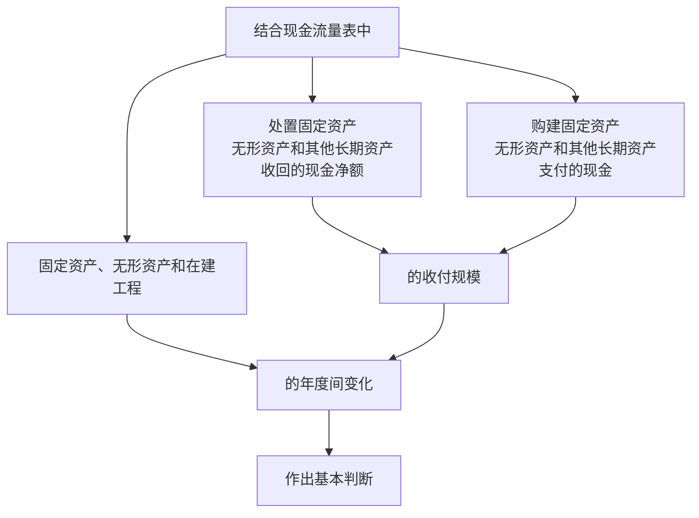

# 第二章 资产质量分析

## 第一节 资产负债的作用

### 一 、 会计计量属性

1. 历史成本（historical cost）
   + 资产按照购置时支付的现金或者现金等价物的金额，或者按照购置资产时所支付的对价的公允价值计量
   + 采用历史成本原则计价优越性
     + 1. 由于交易价格是由企业与企业外部共同确定的，因而具有一定的客观性
       2. 历史成本的确定通常要有一定的会计凭证作为依据，具有可验证性
       3. 还可抑制因主观判断而产生的可能蓄意歪曲企业财务状况的事件发生
2. 重置成本（replacement cost）
   + 资产按照吸纳在购买相同或者相似资产所需支付的现金或者现金等价物的金额计量
3. 可变现净值（net realizable value）
   + 资产按其正常对外销售所能受到现金或者现金等价物的金额扣减该资产至完工时估计将要发生的成本、估计的销售费用以及相关税费后的金额计量
4. 现值（present value）
   + 资产按照预计从其持续使用和最终处置中所产生的未来净现金流入量的折现金额计量
5. 公允价值（fair value）
   + 资产按照公平交易中熟悉情况的交易双方自愿进行资产交换或者债务偿清的金额计量
6. 实际事务中，一般采历史成本。采用其他的应当保证所确定的资产金额等能够取得可靠计量

### 二、资产负债表的作用

1. 揭示企业拥有或控制的能用货币表现的经济资源即资产的总规模即具体分布状态
2. 把流动资产（current assets，1年内可以或准备转化为现金的资产），速动资产（quick assets，流动资产中变现能力较强的货币资金、债权、短期投资等）与流动负债（1年内应清偿的债务责任）联系起来分析，可以评价企业的短期偿债内力
3. 通过企业债务规模、债务结构及与所有者权益的对比，可以对企业的长期偿债能力及举债能力（潜力）做出评价
   + 一般而言，企业所有者权益相对于负债来说规模越大，企业偿清长期债务的能力越强，企业进一步举借债务的潜力也就越大
4. 通过对企业不同时期的资产负债表进行比较，可以对企业财务状况的发展趋势作出判断。
   + 把同一企业不同时间点的资产负债表结合起来分析，能把握企业财务状况的发展趋势
   + 不同企业同一时间点的资产负债表进行对比，还可以对不同企业的相对财务状况做出评价
5. 通过对资产负债表与利润表有关项目的比较，可以对企业各种资源的利用情况作出评价，如考察
   + 资产报酬率
   + 权益报酬率
   + 存货周转率
   + 债权周转率
6. 通过资产负债表与利润表、现金流量表联系分析，可以对企业的财务状况和经营成果作出曾题评价

## 第二节资产负债表的结构

### 一、资产负债表基本结构

1. 主体部分 
   
   | 流动资产  | 流动负债  |
   |:-----:|:-----:|
   | 非流动资产 | 非流动负债 |
   |       | 所有者权益 |
   
   + 变现能力由强到弱
     + 流动资产
     + 非流动资产
   + 负债偿还先后顺序
     + 流动负债
     + 非流动负债
   + 资产=负债+所有者权益

### 二、资产负债表的披露要求

1. 资产负债表中的资产、负债和所有者权益披露 至少应当单独列示反映下列信息
   
   + 资产
     + 货币资金
     + 交易性金融资产
     + 应收及预付款项
     + 存货
     + 持有至到期投资
     + 长期股权投资
     + 投资性房产地产
     + 固定资产
     + 生物资产
     + 无形资产
     + 递延所得税资产
   + 负债
     + 短期借款
     + 应付及预收款项
     + 应缴税金
     + 应付职工薪酬
     + 预计负债
     + 长期借款
     + 长期应付款
     + 应付债券
     + 递延所得税负债
   + 所有者权益
     + 实收资本（或股本）
     + 资本公积
     + 盈余公积
     + 未分配利润

## 第三节 资产质量分析理论

### 一、资产质量的内涵及属性

1. 内涵 资产在特定的经济组织中，实际所发挥的效用与其预期效用之间的吻合度。
   
   + 要求资产，通过对其进行安排与使用，使其预期效用能够得以最大程度的发挥。

2. 属性 
   
   + 资产质量的相对性
     
     1. 相同资产，在不同企业的效用和价值具有相对性
        
        > 在进行及集团化管理的企业实践中，母公司常常采取集中融资，融资后再转而向其控股子公司提供资金的资金管理模式。
        > 
        > 这样的资金管理模式，在母公司自身的财务报表上，一般表现为“三高”：
        > 
        > 1. 企业负债中的贷款规模高
        > 2. 资产项目中的其他应收（其他应收款由于其难以对流动负债提供保障而一般认为是不良资产）高
        > 3. 财务费高
        > 
        > 显然，这三高恶化了母公司的个别财务报表的资产质量，融资能力和盈利能力。
        > 
        > 然而，从企业集团整体来看，集中融资会降低整个企业集团的财务负担，如果控股子公司的盈利能力较高，则母公司巨额不良其他应收款中
        > 
        > 被控股子公司占用的部分对于集团来说就是优质资产。
     
     2. 相同资产，在特定企业不同发展阶段的效用和价值具有相对性
        
        > 通常情况下，在企业发展初期建立起来的生产线，与企业当时的生产和经营规模、业务结构应该是相适应的。
        > 
        > 但随着企业的发展，如果企业原有业务难以继续拓展，其发展只能通过建立新的生产线来拓展新的业务，那么原有的固定资产就有可能失去其价值。
        > 
        > 综合两方面因素，分析资产质量，要与企业其他资产、经营战略、所处行业背景、生命周期结合，站在整体和相对宏观的角度进行分析。
   
   + 资产质量的时效性
     
     + 是指企业多数资产的质量往往随着时间的推移而显著下降
       + 原因如下
         1. 技术变革
         2. 消费者偏好改变
         3. 资产的自然因素
         4. 竞争环境的的变化
       + 因此，企业各类资产保有规模应控制在合理水平上。
       + 研究企业的资产质量，应强调其所处的特定历史时期和宏观经济背景，注意时效性
   
   + 资产质量的层次性
     
     1. 决策层
        + 关注企业资产的整体质量
     2. 协调层
        + 关注企业资产的结构性资产质量
     3. 执行层
        + 更关注个别资产的质量
     4. 研究企业资产质量从三个层面
        1. 资产的总体质量
        2. 资产的结构质量
        3. 资产的个体质量
     5. 不仅要整体上把握，还需要从结构和项目层面作进一步剖析

### 二、资产的质量特征

1. 资产的总体质量特征
   
   > 由于公允价值理念的运用，必然导致资产的计量属性发生变化，金融工具、部分投资性房地产以及债务重组、非货币性资产交换方式取得的资产
   > 
   > 在资产负债表中将反映其公允价值。
   > 
   > 因此按照现行会计准则所确定的利润，应该是建立在资产真实价值基础上的资产利用效果的最终体现，应该更加体现企业资产在价值转移、处置
   > 
   > 及持有过程中的增值质量。
   > 
   > 因而，资产的增值性将成为资产的总体质量特征，是预测企业可持续发展潜力的重要依据。
   > 
   > 但是，现行会计准则由于对公允价值的运用相当谨慎，致使大多数资产的计量属性仍以历史成本为主。因此，利润中并未体现这些资产的持有增值情况，而对计提的减值损失视为该项资产在持有过程中产生的负增值。

2. 资产的结构质量特征
   
   > 资产结构指各种资产相互之间的比例关系。在一定程度上体现了企业对所筹资金做出的一种安排。企业对自己的安排和使用程度上的差异，即资产结构质量的好坏，将直接导致企业经营战略实施，利润获取及价值创造等方面的差异，这些均对企业生产经营和财务活动产生不同的意向

3. 资产的个体质量特征
   
   + 资产的营利性 
     + 是指资产在使用过程中能够为企业带来经济效益的能力，强调的是资产能够为企业创造价值的效用。
     + 在一定程度上决定了企业进行扩大再生产的能力
     + 进而决定了企业的盈利能力及收益质量
     + 资产质量好的公司营利性一般比较高，通过保持稳定的收益能确保上市公司资产升值。
     + 是评价资产质量的最为重要的因素
   + 资产的变现性
     + 也可称为资产的保值性，指非现金资产通过交换能够直接转换为现金的能力，强调资产作为企业债务的物质保障效用。
     + 资产变现强弱，会直接影响企业的偿债能力（尤其是短期偿债能力）的高低
     + 偿债能力是企业能否健康生存与发展的关键
     + 资产能否按照账面价值或者高于账面价值顺利变现，是衡量企业资产质量，并进一步分析企业偿债能力的重要因素
   + 资产的周转性
     + 指资产在企业经营运作过程中被利用的效率和周转速度，强调资产作为企业生产经营的物质基础而被利用的效用
     + 资产只有被日常经营运作过程中被利用，为企业创造价值的效用才能得以体现
     + 资产周转速度越快，说明该资产与企业经营战略吻合度越高，对该资产利用越充分，为企业赚取收益的能力就越强。
     + 资产被利用越频繁，也就越有效，质量越高。
   + 与其他资产的协同性
     + 指资产在特定经济背景下，可能与企业其他相关资产在使用中产生协同效应的能力
     + 强调资产通过与其他资产适当组合，能够发挥出大于单项资产个别效用的联合效用。
     + 一项资产，通过适当安排与整合，与其他企业资产进行组合，共同满足企业的战略要求，体现其真正的增值能力，是企业重组增值的基础。 是资产质量必不可少的重要方面。 

### 企业资产按照质量分类

+ 为便于在理论层面上对企业各项资产按质量分类，分析辨别好坏
  + 可以简单的以资产的账面价值（可以用财务报表中所列示的金额来反映）
  + 与其变现价值或被进一步利用的潜在价值（可以用资产的可变性净值或公允价值来反映）
  + 以上之间的差异来衡量
+ 资产按照其质量分类
  + 按照账面价值等金额实现的资产，包括
    + 货币资金
      + 作为充当一般等价物的特殊商品，企业的货币资金会自动地与任一时点的货币购买力相等。
      + 企业的任一时点的货币资产，均会按照账面等金额实现其价值。
      + 但由于通货膨胀等因素，不同时点相同的货币资金其购买力并不相同。
    + 交易性金融资产
      + 是指能够随时变现并且持有时间不准备超过1年的投资
      + 应符合2个条件
        1. 能够在公开市场交易并且有明确市价
        2. 持有投资作为剩余资金的存放形式，并保持其流动性和获利性
      + 尽管投资有持有期超过1年的情况，仍应作为流动资产处理，除非已经将其改为长期持有目的。
      + 按公允价值计量，报表中所披露的公允价值基本反映了该项目期末的可变现价值，因此，该项目可被认为是能够按照账面价值等金额实现的资产
    + 可供出售金融资产
      + 虽然其归属于非流动资产，但由于其按照公允价值计量，因此与交易性金融资产相似，可被认为是能按照账面价值等金额实现的资产。
      + 由于企业受某种条件的限制不能立即出售该类资产（如企业持有限售股），或由于企业对该类资产的持有意图并不是短期出售获利，因此长期看来，其变现质量存在一定风险。
  + 按照低于账面价值的金额贬值实现的资产
    1. 短期债权
       1. 包括
          1. 应收票据
          2. 应收账款
          3. 其他应收账款
       2. 由于存在发生坏账的情况，因此，要以低于账面的价值进行回收
       3. 计提坏账做法
          1. 单项金额重大
             + 按照未来现金流量现值低于账面价值的差额计提
          2. 单项金额非重大
             + 按照原来账龄分析法计提，由于不可避免的人为主观估计因素，受各种因素制约，企业按照账龄对坏账准备计提百分比的确定不一定能够准确地反映债权的贬值程度。
             + 对债权质量的分析，仅仅靠坏账准备披露的数字是不够的，必须结合企业债务人的情况进一步分析。
    2. 部分存货
       + 在企业采用成本与可变现净值孰低规则对存货进行期末计价的条件下，当存货可变现净值下跌至成本以下时，表明存货给企业带来的未来经济利益低于其账面价值，此时按可变现净值低于成本数额计提存货跌价准备，并将这部分损失计入当期损益
       + 在具体应用成本与可变现净值孰低规则时，有2个需要解决的重要问题
         1. 存货成本的确定
         2. 可变现净值的确定
       + 关于企业存货成本
         + 一般外购存货成本的确定客观性较大
         + 企业自制存货成本的确定，受影响
           + 企业技术装备水平
           + 生产设备的利用程度
           + 企业的折旧政策
           + 企业对共同耗用性制造费用在不同产品之间分摊方法的选择
           + 等因素制约，主观性比较轻
       + 关于可变现净值
         + 指企业在正常经营过程中，以预计售价减去预计完工成本及销售所必须预计费用后的价值
         + 这里 预计售价，预计完工成本，销售所必需的预计费用 均为人工估计，受主观因素影响较大
       + 存货跌价准备在质量方面的含义反映了企业对其存货贬值程度的认识水平和企业可接受的贬值水平
       + 并不排除企业为了保持当期获利水平而低估存货跌价准备的可能，在此情况下，企业存货的实际回收价值就会在其账面价值之下。
    3. 部分持有至到期投资和长期股权投资
       + 为了揭示企业此类昌吉投资因质量下降所产生的贬值因素，企业可以在其资产负债表中计提减值准备。
       + 当计提减值准备并不充分时，其实际变现价值也会在其账面价值之下
    4. 部分固定资产
       + 企业持续经营的条件下，是不会讲正在使用的固定资产对外出售，因此，企业固定资产的质量主要体现在被企业进一步利用的质量上
       + 持续经营企业在资产负债表及其附注表中通常提供固定资产的原值，累计折旧以及固定资产计提的减值准备的情况
       + 由于企业受政策选择和减值准备估计人为因素制约，企业披露的固定资产账面价值无法反映资产负债表日相应固定资产对应企业的实际价值
       + 实际上，企业固定资产中，有相当一部分将在未来增值，如企业的房地产等。
       + 也有相当一部分固定资产正在快速贬值，如技术含量较高，技术进步较快的高科技资产
    5. 纯摊销性的“资产”
       + 是指那些由于应计制原则的要求而暂作“资产”处理的有关项目，包括长期待摊销费用的项目
       + 应该说，除个别项目有可能包含对企业未来有利的资产内容外，上述项目主体并不能为企业未来提供实质性的帮助，没有实际利用价值，实际价值趋于0
  + 按照高于账面价值的金额增值实现
    + 指那些账面价值较低，而其变现价值或被进一步利用的潜在价值（可以用资产的可变现净值或公允价值来计量）较高的资产。
    + 包括
      1. 大部分存货
      2. 部分持有至到期投资和长期股权投资
         + 从总体上来说，企业的此类投资性资产应该通过转让或收回投资，持有并获得股利或者债权投资收益等方式来实现增值。该类资产的增值程度取决于其营利性的大小，但正常情况下，至少可以按照账面价值收回投资。
      3. 部分固定资产和生产性生物资产
         + 企业的部分固定资产和生产性生物资产通过持有和运用等方式来实现增值，增值程度取决于其营利性、稀缺程度、自身属性等诸多因素
         + 由于固定资产在运用过程中实现的增值并不能反映在账面价值上，因而在变现时就有可能高于账面价值
      4. 账面上未体现其价值，但可以增值实现的“表外资产”
         + 指那些因会计处理原因或计量手段的限制而未能在资产负债表中体现价值，但可以为企业在未来作出贡献的资产项目
         + 包括
           1. 已经提足折旧，但企业仍然继续使用的固定资产。
              + 其在资产负债表上由于历史成本与累计折旧相等而未能体现出净值
              + 企业建筑物、设备、及生产线等有可能出现这种情况
           2. 正在使用，但已经作为低值耗品一次摊销到费用中去、资产负债表上未体现价值的资产
           3. 已经成功的研究和部分已经列入费用的而开发项目成果
              + 企业研究和开房支出，一般作为支出当期的费用处理
              + 只有成功的开发支出才作资产负债表上的资产处理，这样已经成功的研究和部分列入费用的开发项目成果，将游离于报表之外。但其能够预期给企业带来未来的经济利益，所以他也属于企业拥有的资产。
              + 这种情况常常出现在重视研究和开发、历史悠久的企业。
           4. 人力资源
              + 企业最重要的一项无形资产

## 第四节 流动资产质量分析

### 一、流动资产的含义及构成

- 含义
  
  - 一般指企业可以或准备在1年内或者超过1年的一个营业周期内转化为货币或被销售或被耗用的资产。

- 我国资产负债表，变现能力的强弱 依次为
  
  - 货币资金
  
  - 短期投资（交易性金融资产）
  
  - 应收票据
  
  - 应收账款
  
  - 预付款项
  
  - 应收补贴款
  
  - 其他应收款
  
  - 存货
  
  - 待摊费用
  
  - 待处理流动资产净损失
  
  - 1年内到期的长期债券投资（持有至到期投资）
  
  - 其他流动资产

- 几点说明
  
  - 营业周期
    
    + 一般来说，是指企业从支付货币购买商品或劳务开始，到这些商品或劳务重新转化为企业的货币为止的时间
    
    + 大多数企业，营业周期小于1年 如
      
      + 商业企业
      
      + 批量生产的工业企业
      
      + 服务业等
    
    + 长于1年 如
      
      + 造船企业
      
      + 工程建筑企业等
    
    + 流动资产与企业非流动资产项目划分，通常按1年内能否或是否准备1年内变现或消耗来划分
    
    + 企业营业周期长于1年的条件下，则应以营业周期为标准来划分流动资产和非流动资产
  
  - 流动资产与特定资产的物理特性
    
    + 特定资产的物理特性
      
      + 是指有关资产的最终可利用性能
        
        + 有的资产可多次反复被最终消费者使用（如冰箱、房屋）
        
        + 有的则可能被最终消费者一次性消耗掉（如办公用品）
    
    + 对企业而言，一项特定资产是否被列为流动资产，不取决于特定资产的物理特性，而仅仅取决与企业持有该项资产的目的
      
      + 如果持有目的是1年内或一次性消耗的（表现未售出或一次性使用完毕），则作为流动资产
      
      + 反之，则为非流动资产
    
    + 如，对于生产汽车的企业，用于销售，则为流动资产；用作自己运输活动，长期参加企业的经营周转，则为固定资产
  
  - 流动资产的实际构成与管理要求
    
    - 在实际中， 流动资产的构成可能与前面的概念有一定的差异，如对某些资产，虽然耗用期在1年或一个营业周期以上，但可能由于其单价较低，在管理上为了抓主要矛盾，大部分企业俊吧这类资产作为流动资产管理，如低值易耗品的处理

### 二、货币资金质量分析

- 货币资金（cash）
  
  - 含义
    
    - 指企业生产经营过程中停留与货币形态的那部资金，他具有可立即支付手段并被普遍接受等特性。
  
  - 资产负债表中反映货币资金包括
    
    - 库存现金
      
      - 指存放与企业财会部门并由出纳人员保管作为零星开支使用的现钞，是流动性最大的货币资金
    
    - 银行结算户存款
      
      - 指企业存放在当地开户银行或其他金融机构存款账户上的货币资金
    
    - 外埠存款
      
      - 指企业到外地进行临时或零星采购时，汇往采购地银行开立采购账户的存款
    
    - 银行汇票存款
      
      - 指企业为取得银行汇票或银行本票按规定存入银行的款项
    
    - 银行本票存款
      
      - 同上
    
    - 信用证存款
      
      - 指企业采用信用证结算方式向国外付款，委托银行开出信用证时存入银行信用证保证金专户的款项
    
    - 信用卡存款
      
      - 指企业为了便于开展经营业务而将现金交存银行后办理的各种信用卡中的存款
    
    - 在途资金
      
      - 指企业同所属单位之间和上下级之间的汇、解款项，在月终时未到达的汇入款项

- 货币资金质量
  
  - 主要指企业对货币资金的运用质量及企业货币资金的构成质量。
  
  - 货币资金质量分析，从以下几方面进行
    
    1. 分析企业日常货币资金规模是否适当
       
       + 为维持企业经营活动正常运行，企业必须保有一定的货币资金余额。
       
       + 从财务管理角度，过低的货币资金保有量，会严重影响企业的正常经营活动，制约企业的发展，进而影响企业的商业信誉
       
       + 过高的货币资金保有量，则浪费投资机会，还会增加企业的筹资成本
       
       + 货币资金的适当规模主要有下列因素决定
         
         1. 企业的资产规模、业务收支规模。
            
            + 一般企业资产总额月底，相应的货币资金规模越大，业务收支频繁，且绝对额大的企业，处于货币资金形式的资产也会较多
         
         2. 企业的行业特点。行业特点也制约着货币资金规模，银行业，保险业与工业企业，在相同的总资产规模条件下，不可能保持相近规模的货币资金
         
         3. 企业对货币资金的运用能力。货币资金，如果仅停留在货币形态，则只能用于支付，其对企业资产增值的直接贡献将会很小，而如果企业的管理人员能善于利用货币资金，从事其他经营或投资活动，则企业的获利水平有可能提高。
         
         4. 就是说，企业过高的货币资金规模，可能意味着企业正在丧失潜在的投资机会，也可能表明企业的管理人员生财无道。
         
         5. 此外，还要考虑企业近期偿债的资金需求，企业的利润状况和带来的现金后果、所处的融资环境等
    
    2. 分析企业在货币资金收支过程中的内部控制制度的完善程度以及实际执行质量
    
    3. 分析企业对国家有关货币资金管理规定的遵守质量
    
    4. 分析企业货币资金构成质量
       
       1. 企业资产负债表上的货币资金金额代表了资产负债表日企业的货币资金拥有量。

### 三、交易性金融资产质量分析

+ 金融资产
  
  + 是一切可以在有组织的金融市场上进行交易、具有现实价格和未来股价的金融工具的总称
  
  + 最大特征
    
    + 是能够在市场交易中为其所有者提供即期或远期的货币收入流量
  
  + 主要包括
    
    + 库存现金
    
    + 银行存款
    
    + 应收款项
    
    + 债权投资
    
    + 股权投资
    
    + 基金投资
    
    + 衍生金融工具形成的资产等
  
  + 不包括（货币资金和长期股权投资），根据自身业务特点、投资策略和风险管理要求，分为四类
    
    + 交易性金融资产（tradable financial assets）
      
      + 指企业为了近期内出售而持有的金融资产，主要是企业以赚取差价为目的从二级市场购入各种有价证券，包括
        
        + 股票
        
        + 债券
        
        + 基金
      
      + 进行金融资产投资的目的是将一部分闲置的货币资金转换为有价证券，从而获取高于同期银行存款利率的超额收益
      
      + 同时又可保持高度变现性，在企业急需货币资金是可以及时出售变现
      
      + 计量以公允价值为基本计量属性，无论是在其取得是初始计量还是在资产负债表日的后续计量
      
      + 在持有交易性金融资产期间，公允价值变动在利润表上均以“公允价值变动损益”计入当期损益
      
      + 出售交易性金融资产时，不仅要确认出售损益，还要将原计入“公允价值变动损益”的金额转入“投资收益”
      
      + 分析交易性金融资产质量特征时，应关注其公允价值计量属性，着重分析该项目的营利性大小，具体应分析两方面
        
        + 1. 分析同期利润表中的“公允价值变动损益”及其在会计报表附注中对该项目的详细说明，通过把握因交易性金融资产投资而产生的公允价值变动损益为正还是为负，来确定该项资产的盈利能力
          
          2. 分析同期利润表中“投资收益”及其在会计报表的附注中对该项目的详细说明，通过把握因交易性金融资产投资而产生的投资收益为正还是为负，来确定该资产的盈利能力
      
      + 若此项投资规模过大，必然影响企业的正常生产经营，而有人为将长期投资划转入该项目挂账之嫌，以“改善”其流动比率。可以从其规模的波动情况，现金支付能力，投资收益构成等方面进行分析判断
    
    + 持有至到期投资
    
    + 贷款
    
    + 应收款项
    
    + 可供出售金融资产

### 四、应收票据质量分析

+ 应收票据（notes receivable）
  
  + 是指企业因赊销产品、提供劳务等采用商业汇票结算方式下收到的商业汇票而形成的债权
  
  + 在确认时，由于依据的赊销业务中的债权人或债务人签发的表明债务人在约定时日应偿付约定金额的书面文件，并具有法律效力，因而受到法律的保护，具有较强的变现性。
  
  + 商业汇票是商品经济高度发达的产物，其实质是一种商业信用行为，其本身也是一种有价证券。
  
  + 在到期之前，企业如果需要资金，可将持有的商业汇票背书后向银行或其他金融机构办理贴现，取得现金，因而也在另一方面保证其具有较强的变现性。
  
  + 在分析其质量特征及强调其具有较强的变现性的同时，必须关注其可能给企业财务状况造成的负面影响。 
  
  + 《中华人民共和国票据法》规定，票据贴现具有追索权，即如果票据承兑人到期不能兑付，背书人富有连带付款责任。
  
  + 这样，对企业而言，以贴现商业汇票是种“或有负债”，若已贴现应收票据过大，可能对企业财务状况带来较大影响，所以在分析该项时，应结合会计报表附注中的相关披露，了解企业是否存在已贴现的商业汇票，据以判断其是否会影响企业将来的的偿债能力。

### 五、应收账款质量分析

+ 应收账款（accouts receivable）
  
  + 指企业因赊销商品、材料、提供劳务等业务而形成的商业债权。
  
  + 这种债权应向购货单位或接受劳务单位收取
  
  + 对于相当多的企业来说，营销自己的产品或劳务，形式如下
    
    + 预收款（如广告业）
    
    + 赊销
    
    + 现销
  
  + 因此，债权规模与企业经营方式和所处行业有直接联系，如
    
    + 零售业，大部分为现金销售业务，商业债权较少
    
    + 工业企业，相当一部分采用赊销方式，商业债权较多
  
  + 企业赊销商品，就是向购买方提供商业信用，所以
    
    + 放宽信用政策，会刺激销售，增大债权规模
    
    + 紧缩信用政策，会制约销售，较少债权规模
  
  + 同时应注意
    
    + 企业应收账款规模越大，发生坏账的可能性越大，因此，企业信用政策放宽到一定程度之后，销售规模进一步扩大并不一定能最终带来企业盈利的提高。
    
    + 因此，合理确定信用政策，在刺激销售和减少坏账间寻找赊销政策的最佳点，是企业营销策略中必须解决的问题。
    
    + 而对于应收账款项目来说，分析其变现性的大小是对其质量分析的关键，主要从以下几个方面
    
    + 1. 对债权的账龄进行分析
         
         + 对债权账龄进行分析，是最传统的一种方法
           
           + 通过对债权的形成时间进行分析，进而对不同账龄的债权分别判断质量：对现有债权，按欠账期长短（即账龄）进行分类分析
           
           + 一般，未过信用期或已过信用期但拖欠期较短的债权出现坏账的可能性比已过信用期较长时间的债权发生坏账的可能性小
           
           + 账龄分析表
           
           | 客户                           | 未过信用期 | 已过信用期小于3个月 | 已过信用期大于3个月小于1年 | 已过信用期1~3年 | 已过信用期3年以上 |
           | ---------------------------- | ----- | ---------- | -------------- | --------- | --------- |
           | 甲        乙        丙        丁 |       |            |                |           |           |
           | 合计                           |       |            |                |           |           |
      
      2. 对债权人的构成进行分析
         
         + 很多情况下，企业债权质量，不仅与账龄有关，更与债务人的构成有关
         
         + 对债权人的构成分析，有如下几个方面
           
           1. 从债务人的行业构成来分析
              
              + 不同行业的成长性差异可能很大
              
              + 同一行业企业的财务状况质量方面具有较大的相似性
              
              + 对债务人行业构成分析至关重要
           
           2. 从债务人的区域构成来分析
              
              + 经济发展水平较高、法制建设条件较好以及特定的经济环境较好的地区的债务人，一般有较好的债务清偿心理，因而这地区的债权可回收性强。
              
              + 经济发展水平较为落后，法制建设条件较为薄弱以及特定经济环境较差（如面临战争）地区的债务人，还款能力较差。
           
           3. 从债务人的所有权性质来分析
              
              + 不同所有制企业，对其自身债务的偿还心态以及偿还能力有着较大的差异
           
           4. 从债权企业与债务人的关联情况来分析
              
              + 可以把债务人分为关联方债务人与非关联方债务人
              
              + 关联方操纵色彩较强，因此，对关联方债务人的偿还情况应予以足够重视
           
           5. 从债务人的稳定程度来分析
              
              + 稳定债务人的偿债能力，一般好把握，当同时要关注近期是否发生了财务困难
              
              + 一般，稳定债务人过多，通常意味着企业经营没有太多起色
              
              + 临时性或不稳定的债务人，虽然有可能是企业扩展其经营的结果，但其偿债能力一般较难把握。
           
           6. 从债务人的信用构成来分析
              
              + 一般，信用等级较高的债务人，其还债能力较强，企业相应的债权质量也较高
              
              + 但企业的信用等级是动态的，与企业面临的经营环境，资本结构及人力资源结构的变化密切相关
      
      3. 对形成债权的内部经手人构成进行分析
         
         + 一般来说，企业外部报表使用者，不大可能对形成企业债权的内部经手人构成进行分析
         
         + 企业管理者，则完全可以
         
         + 大量实践表明，形成债权的内部经手人对企业债权的质量影响重大
         
         + 通过考察其业务素质和道德素质，既可以为管理者合理调配企业内部工作安排提供重要参考，也可以引导企业管理者较早的关注企业债权质量较差的区域，及时采取有效措施
      
      4. 对债权的周转情况进行分析
         
         + 可借助应收账款周转率、应收账款平均收账期等指标进行分析
         
         + 一定的赊账政策条件下，企业应收款平均收账期越长，债权周转速度越慢，债权的变现性越差
      
      5. 对坏账准备政策进行分析
         
         + 由于资产负债表中列示的是应收账款净额，因此，在分析应收账款的质量时要特别关注企业坏账准备计提的合理性。
         
         + 现行会计准则强调应收账款作为一项金融资产，应当在资产负债表日对其进行减值检查，将其账面价值与预计未来现金流量现值之间的差额，确认为减值损失，计入当期损益。
         
         + 1. 金融资产发生减值的客观依据
              
              1. 发行方或债务人发生严重的财务困难
              
              2. 债务人违法合同条款，如偿付利息或本金发生违约或逾期等
              
              3. 债权人处于经济或法律等因素的考虑，对发生财务困难的债务人作出让步
              
              4. 债务人很可能倒闭或进行其他的财务重组
              
              5. 发行方发生重大财务困难，该金融资产无法在活跃市场继续交易
              
              6. 由此来看，企业的应收账款是否发生减值以及减值程度的大小取决于该项目预计未来现金流量的现值，而不再过分强调所采用的坏账准备计提方法
           
           2. 应收账款的减值测试方法
              
              + 1. 对于金额重大的应收账款，采用个别认定法
                
                2. 对于单项金额不重大的应收账款，可以单独进行减值测试，或包括在具有类似信用风险特征的金融资产组合中进行减值测试
                   
                   + 这里所说的具有类似信用风险特征的金融资产组合，应根据企业对应收账款的风险关联程度进行深入分析
                   
                   + 如相同账龄的具有类似信用风险特征，或同一对企业集团、同一地区或国家的企业的应收账款我具有类似信用风险特征
                
                3. 对于单独测试未发生减值的应收账款（包括单项金额重大和不重大的应收账款）应当包括在具有类似信用风险特征的金融资产组合中再进行减值测试
                
                4. 由此看出，现行会计准则下应收账款坏账损失的计提含有较强的人为因素，在相当程度上取决于企业对该项目的主观判断，因此不能排除企业在此方面存在不可告人的目的

### 六、存货质量分析

+ 存货（inventory）
  
  + 指企业在正常生产经营过程中持有以备出售的产品或商品，或者为了出售仍然处在生产过程中的在产品，或者将在生产过程或提供劳务过程中耗用的材料、物料等
  
  + 最基本物征
    
    + 企业持有存货的目的是为了出售，而不是自用或消耗，区别于固定资产等长期资产
    
    + 资产作为存货处理，不取决于资产的物理特性，而取决于企业持有特定资产的持有目的：如果持有目的是短期周转、销售或快速消耗掉，则应作为存货处理。
  
  + 存货构成
    
    + 工业企业
      
      + 库存
      
      + 加工中和在途的各种原材料、燃料、包装物
      
      + 低值易耗品
      
      + 在产品
      
      + 外购商品
      
      + 自制半成品
      
      + 产成品
      
      + 分期收款发出商品等
    
    + 商品流通企业
      
      + 企业在库、在途、出租和加工中的各种商品
      
      + 在途商品
      
      + 库存商品
      
      + 加工商品
      
      + 出租商品
      
      + 分期收款发出商品
      
      + 和材料物资
      
      + 包装物
      
      + 低值易耗品等
      
      + 企业委托代销商品
  
  + 存货质量分析，应关注以下几个方面
    
    + 存货是企业一项重要流动资产，占比较大，对公司的风险影响和财务状况至关重要。存货通常占用企业大量资金，会给企业带来持有成本（机会成本，仓储成本等）和持有风险（过期分析、降价风险等），因此如何保证正常生产经营运转的同时，最大限度的降低存货持有量并保持存货价值，尽可能加速存货周转，将成为存货管理至关重要的方面
    
    + 主要应从营利性，变现性及周转性三个重点进行分析，但首先要分析存货的物理质量、实效状况和品种构成
      
      + 1. 对存货物理质量分析
        + 物理质量是指存货的自然质量，即存货的自然状态
        
        + 如 商业企业代售商品是否完好无损，制造业产成品质量是否符合相应产品的等级要求
      
      + 2. 对存货时效状况分析
        + 是指对时效较强的企业存货的时效性状况进行分析
        
        + 与时效性相关的企业存货，是指那些营利性和变现性与时间联系较大的企业存货
        
        + 按时效性分类
          
          + 与保质期相关的存货
            
            + 如食品
          
          + 与内容相关的存货
            
            + 如出版物
          
          + 与技术相关的存货
            
            + 科学技术
            
            + 配方诀窍的无形资产
            
            + 计算机技术
            
            + 中药配方，药品配方，食品配方等
      
      + 3. 对存货品种构成分析
        + 在企业生产和销售多种产品的条件家，不同品种的产品的盈利能力、技术状态、市场发展前景以及产品的抗变能力等可能有很大的差异。过分依赖某种产品或几种产品的企业，极有可能因产品出现问题而使企业全局受到重创。
        
        + 因此应当对企业存货的品种构成进行分析，关注不同品种的产品盈利能力，技术状态、市场犯罪前景及产品的抗变能力等方面状况
      
      + 4. 对存货毛利率走势分析，考察存货营利性
        + 很大程度上体现了企业在存货项目上获利空间，也反映了企业在日常经营活动中的初始获利空间。
        
        + 毛利率下降
          
          + 或者意味着企业的产品在市场上的竞争力下降
          
          + 或者意味着企业的产品生命周期出现了转折
          
          + 或者意味着企业生产的产品面临着激烈的竞争
        
        + 企业年度间毛利率的变化，也有可能是企业通过低转或高转成本、改变存货计价和盘存方式等手段，人为进行利润操纵的结果。
      
      + 5. 对存储期末计价和存货跌价准备计提分析，考察存货变现性
           
           1. 现行会计准则规定，存货的期末计价采用成本与可变现净值孰低法，对于可变现净值低于成本的部分，应当计提存货跌价准备。
           
           2. 存货跌价准备在质量方面的含义是反映了企业对其存货贬值程度的认识水平和企业可接受的贬值水平。
           
           3. 可变现净值，指企业在正常经营过程中，以预计售价减去预计完工成本以及销售所必须的预计
              
              1. 这就涉及对预计售价、预计完工成本以及销售所必须的预计费用等因素的估计。 
           
           4. 既然是人为估计，难免受主观因素影响，因此在对存货跌价准备计提分析，考察存货的变现性时，应对其计提的合理性进行判别。
              
              1. 要特别关注企业是否存在利用存货项目进行潜亏挂账的问题
                 
                 > 一些企业利用存货项目的种类犯罪、金额庞大、重置频繁、计价方法多样、审计难度大等特点，采用种种非法手段，将冷背呆滞商品、积压产品、残品等已经失去了变现性的存货及不符合财务制度的费用开支等，通过在存货项目中长期挂账，来隐蔽潜在的亏损局面。
              
              2. 还要注意考察企业是否通过存货跌价准备计提来进行巨额摊销，为来年的“扭亏为盈”提供机会
              
              3. 还要关注报表附注中有关存货担保、抵押方面的说明
      
      + 6. 对存货周转率分析，考察存货周转性
           
           1. 存货周转率是一个动态的内部管理指标，其反映了一定时期存货流转的速度。
           
           2. 从公式上看，他是销售成本和平均存货水平的比值，通常越大越好。他是动态运营的反映。因为，销售成本取决与公司采购成本，转换成本，其他成本和成本计算方法，而平均存货水平也是连续的运营作用的综合结果。
           
           3. 企业关注焦点在于减少存货和加速流转。
           
           4. 减少存货可以有效地减少资金占用和降低经营风险，改善公司的财务状况和提高抵抗风险的能力
           
           5. 加速流转可以有效提供公司的盈利能力。在周转一次可以产生毛利的情况下，在其他条件相同时，企业存货周转速度越快，一定时期的盈利水平也就越高。

### 七、其他流动资产项目的质量分析

1. 预付款项   
   
   + 是企业按照购货合同的规定，预先支付给供货单位的货款而形成的债权。
   
   + 在会计上，预付款按实际支付的金额入账
   
   + 在计算坏账准备时，在债权中不包括预付款项
   
   + 一般情况下，企业的预付款项债权不会构成流动资产的主体部分
   
   + 如果预付款较高
     
     + 可能与企业所处行业经营特点和付款方式相关
     
     + 也可能由企业以往的商业信用不高所引起
     
     + 也可能是企业向有关单位提供贷款的信号，如果是此类，则该项将很有可能成为不良资产区域
     
     + 而在供货商较为稳定条件下，企业预付款项应按照约定转化为存货，因此正常的预付款项质量较高。

2. 其他应收款
   
   + 是指企业除应收票据、应收账款、应收股利、应收利息和预付款项以外的各种应收、暂付款项。
   
   + 包括
     
     + 没设置“备用金”科目的企业拨出的备用金
     
     + 应收的各种赔款、各种罚款、存出的保证金
     
     + 应收出租包装物的租金
     
     + 应向职工个人收取的各种垫付款项
     
     + 预付款项转入等
   
   + 其他应收款项，不属于企业主要的债权项目，数额及所占比例不应过大。
   
   + 如果数额过高，即为不正常现象，为此要借助报表附注分析其具体构成项的内容和发生时间，特别是金额较大，时间较长，来自关联方的其他应收款
   
   + 要警惕企业利用该项目粉丝利润，大股东抽逃和无常张勇资金及转移销售收入偷逃税款等行为。在这些情况下， “其他应收款”中的主要内容就成了无直接效益的资源占用，无论是从营利性还是从变现性和周转性来看，其质量均较低。
   
   + 因此要特别关注这小项目中潜伏的大危机
   
   + 对于一些对外投资比较广泛，自己较少从事经营活动的起来自身的财务报表中，较大规模的其他应收款实际上可能代表了投资方对被投资企业提供的经营资金。此时，比较一下，投资方自身报表与合并报表中“其他应收款”的相关金额，如果合并报表数字小于投资方自身报表数字，则差额基本上代表了投资方向被投资方提供的资金。此时，其他应收款的质量取决于被投资者的盈利能力和质量

3. 应收股利、应收利息
   
   + 应收股利反映公司因股权投资而应收取的现金股利。（公司应收其他单位的利润也包括在此项中）
   
   + 应收利息反映公司因债权投资而应收取的利息。公司购入到期还本付息债券应收的利息不包括在此项内

4. 1年内到期的非流动资产
   
   + 反映企业非流动资产中1年内到期的部分，主要包括
     
     + 擦汗更年期债权投资等
   
   + 由于其有明确的到期日，一般说变现性较高、质量较好。

### 八、流动资产整体质量分析

1. 关注经营性流动资产的周转状况
   
   + 经营性流动资产是指企业的流动资产减去交易性金融资产以后的部分。
   
   + 经营性流动资产的周转状况严重影响企业的营业利润，经营活动产生的现金流量净额
   
   + 企业流动资产包含较大比重交易性金融资产的情况下，流动资产周转率不能恰当的反映经营性流动资产的周转情况，应该使用经营性流动资产的周转率来衡量其周转状况。

2. 关注流动资产对流动负债的保证程度
   
   1. 考察营运资本与流动比率、速动比率
      
      + 流动资产对流动负债的保证程度，可以用流动资产与流动负债的差（即营运资本，营运资金，净流动资产）和流动资产除以流动负债（即流动比率）来考察，也可以用速动资产（即流动资产减存货）除以流动负债（即速动比率）来考察。
      
      + 一般认为，流动比率保持在2:1较为合适，速动比率保持在1:1较为合适
      
      + 还需考虑企业会计期末财务信息是否有代表性，即企业流动资产和流动负债的具体构成情况，和企业所处行业的具体经营特点。
   
   2. 考察流动资产的有效性
      
      + 流动资产的有效性，可以从剔除不良流动资产、充分考虑存货质量来入手：应将基本不能用于偿还流动负债的"其他应收款"以及呆滞”存货“从流动资产中剔除，并充分考虑企业存货的周转和毛利率的状况。
   
   3. 考察流动负债的“沉淀”状况
      
      + 企业的某些流动负债也有可能最终不用支付的情况
      
      + 不用支付的负债，可作为长期负债来看，要从近期需要支付的债务中剔除
   
   4. 考察企业对流动资产和流动负债会计处理的恰当性
      
      + 出于某些目的，在某些会计期末过分高估或低估各项减值准备、高估或者低估预计负债的情况下，企业流动资产对流动负债的保证程度会被严重歪曲。此时，就不能按照基本的流动比率或者速动比率来判断企业流动资产的质量。

## 第五节 主要非流动资产质量分析

### 非流动资产（non-current assets）

+ 指企业资产中变现时间在1年以上或长于1年的一个营业周期以上的那部分资产

+ 其预期效用主要是
  
  + 满足企业正常的生产经营需要，保持企业适当的规模和竞争力，获取充分的盈利

### 质量分析

#### 1. 可供出售金融资产（financial assets available for sale）

+ 是指企业没有划分为交易性金融资产、持有至到期投资、贷款和应收款项的金融资产，如

+ 企业购入的在活跃市场上有报价的股票、债券和基金等，没有划分为公允价值计量且变动计入当期损益的金融资产或持有至到期投资等金融资产

+ 对此类资产，企业并不打算随时变现，而是欲通过长期持有来获取收益，因此，一般，其周转性并不强。

+ 该资产应按取得金融资产的公允价值和相关交易费用之和作为初始确认金额。

+ 支付的价款中包含的已到付息期但尚未领取的债券利息或已宣告但未发放的现金股利，应单独确认为应收项目。

+ 可供出售金融资产持有期间取得的利息或现金故乡，应当计入投资收益。

+ 资产负债表日，可供出售金融资产应当以公允价值计量，且公允价值变动计入资本公积（其他资本公积）

+ 当企业急需现金时，该项目便可以按照公允价值变现，转换为已知金额的现金，其变现性比较强（限售部分除外）

+ 处置可供出售金融资产时，应将取得的价款与该金融资产账面价值之间的差额计入投资损益；同时，将原直接计入所有者权益的公允价值变动累计额对应处置部分的金额转出计入投资损益。

+ 由此可见，该项的全部利益只有在出售时才能在当期损益中体现出来，其营利性大小完全取决与出售价格与其初始购买成本之间的差额。

+ 此外，分析时还必须关注分类是否恰当，确认是否符合相应的标准，会计处理是否正确。

+ 尽管按规定，一旦规定为交易性金融资产，不能再重分类为其他类别金融资产，其他类金融资产也不能再重分类交易性金融资产，但企业仍有可能出于粉饰业绩的目的，将升值的金融资产划分为交易性金融资产，把公允价值变动收益直接确认为当期损益，而将贬值的金融资产划分为可供出售金融资产，把公允价值变动损失通过计入资本公积来避免对当期损益造成的负面影响。

#### 2. 持有至到期投资质量分析

+ 是指到期固定、回收金额固定或可确定，且企业有明确意图和能力持有至到期的非衍生金融资产。

+ 包括
  
  + 活跃市场上公开报价的国债
  
  + 企业债
  
  + 金融债券等

+ 持有到期投资的目的是通过定期收取利息来获取长期稳定的收益，同时又由于到期收回本金从而很大程度上降低了投资风险。

+ 1. 营利性分析
     
     + 主要持有国债，企业债，金融债
     
     + 营利性分析，首先应当根据当时宏观金融市场环境，判断投资收益的相对水平。
     
     + 一般收益率应高于同期银行存款利率，具体收益水平要视债券种类及所承受的风险大小来定
     
     + 还要注意，该投资收益是按照权责发生制原则确定的，并不与现金流入量相对应，即无论投资企业是否收到利息，都要按应收利息计算出当期投资收益
     
     + 大多数情况，投资收益的确认都先于利息的收取，由此会在一定程度上导致投资收益与现金收入不一致。
  
  2. 根据其项目构成及其债务人构成分析其变现性
     
     + 债务人能否定期支付利息，到期偿还本金，取决于债务人在需要偿还的时点是否有足够的现金。
     
     + 因此，有必要对其项目构成及债务人构成进行分析，判断债务人偿还能力，来评判该项目的变现性。
     
     + 分析时可参阅会计报表附注中关于持有至到期投资明细表，并结合其他市场信息等因素进行
  
  3. 根据其减值情况分析变现性
     
     + 当其发生减值时， 应当将其账面价值减值预计未来现金流量的现值。
     
     + 因此，通过分析该项目减值准备的计提情况，判断其变现性。
     
     + 但必须注意，一些企业出于粉饰业绩的目的，通过少提或多提减值准备的方式来达到虚增或虚减其投资账面价值和利润的目的。
     
     + > 按照我国现行会计准则的规定，大部分长期资产，如固定资产，无形资产，长期股权投资以及采用成本模式计量的投资性房地产所计提的资产减值准备一经计提变不得再冲回，而对持有至到期投资，贷款和应收款项等金融资产，计提兼职准备后，如有客观证据表明该项目价值有所回升，且客观上与确认该损失后的事项有关（如债务人信用评级已经提高）的，原计提的减值准备允许予以冲回，因此要警惕企业通过该项目“重操旧业”的情况发生。

#### 3. 长期股权投资-long-term equity investment

+ 指企业持有的对其子公司、合营企业及联营企业的权益性投资及企业持有的对被投资单位不具有控制、共同控制或重大影响，并且在活跃市场中没有报价、公允价值不能可靠计量的权益性投资。

+ 1. 营利性分析
     
     + 长期股权投资项目的营利性呈现出较大的波动性，具体要依据其投资方向、年内所发生的重大变化、投资所运用的资产种类、投资收益确认方法等诸多因素来确定
     
     + 1. 长期股权投资方向对营利性的影响
          
          > 在考察长期股权投资方向时，应该主要考察的是投资方的投资方向或者构成与其核心竞争力之间的关系。在投资方属于某个行业上有核心竞争能力的条件下，其对外投资如果与其自身的核心竞争能力相一致,则在投资的管理上,除对被投资方有财务贡献以外,投资方会在技术、管理、市场等方面对被投资方进行实质性贡献。在业绩方面,投资方由于与被投资方行业极有可能一致,因此,双方的业绩会经常呈现出同方向变化;反之,如果其对外投资如果与其自身的核心竞争能力不相一致，则可能是投资方实现其行业多元化战略的努力。此时，投资方和被投资方在某些时期的业绩上极有可能出现互补的态势。
       
       2. 长期股权投资年度内的重大变化对营利性的影响
          
          + 重大变化 几种情况
            
            1. 收回或者转让某些长期股权投资儿导致长期股权投资减少
               
               + 或是企业试图优化自身的投资结构而进行的投资结构调整
               
               + 或是为了变现而进行的股权投资出售活动
               
               + 可能是按照某些约定而收回投资
            
            2. 增加新的长期股权投资而导致长期股权投资增加
               
               + 或是企业继续其对外扩张态势而进行的努力扩张
               
               + 或是企业为了实现业绩增长而进行的投资组合调整
               
               + 可能是为了利用表内表外的非货币资源而进行的资产重组活动
            
            3. 因权益法确认投资收益而导致长期股权投资增加
               
               + 一般应该认为这种增加是一种“泡沫”资产的增加，对企业难以产生实质性的正面贡献
       
       3. 长期股权投资所运用资产种类对营利性的影响
          
          + 投资所运用的资产种类
            
            + 可以货币资金对外投资
              
              + 由于货币资金具有投资方向不受限制的特点，企业因此而形成对外投资在方向上具有选择性强的特点，此类投资可以对投资方向多元化形成直接贡献。
            
            + 以表内的非货币资源对外投资
              
              + 企业有可能是在实施资产重组战略，但其投资方向受原有资产结构和质量的影响较大，在投资结构上可能与企业原有经营活动联系较为紧密
            
            + 可以表外的无形资产对外投资
              
              + 这种投资的安排应该被认为是企业表外资源价值实现的一种方式
       
       4. 长期股权投资收益确认方法对盈利晓的影响
          
          > 1. 成本法下，企业长期股权投资，通常反映投资的初始作价（历史成本）。
          > 
          > 2. 追加货收回投资应当调整长期股权投资的成本。
          > 
          > 3. 在投资发生重大吃就行不可逆转的贬值时，才对“长期股权投资”项目作减值处理，并确认投资损失。
          > 
          > 4. 当收到被投资单位分发的股利（或被投资单位宣布发放现金股利时），在会计上确认投资收益。
          > 
          > 5. 投资企业确认投资收益，仅限于被投资单位接受投资后产生的积累净利润的分配额，所获得的利润或现金股利查过上述数额的部分作为初始投资成本收回。也就是说，成本法下的投资收益确认与货币资金的流入有直接关系，即成本法下的投资收益不会带来利润（投资收益）和长期投资的“泡沫”（这里“泡沫”是指不能用于支付或者分配的资产和利润）成分。
          > 
          > 6. 在权益法下，被投资方被投资后，有利润时，不论被投资方是否分配现金股利，投资方均按照被投资方的新增净利润的持股份额确认投资收益，同时确认长期投资性资产金额的增加。在被投资方分配现金股利时，则相应冲减长期投资的金额。但是从整体来看，被投资方不可能将其实现的净利润全部作为现金股利分配掉。因此，权益法确认投资收益会不可避免的出现投资收益和长期股权投资“泡沫”成分。“泡沫”成分的大小，取决于被投资发分派现金股利的程度。
       
       5. 投资收益确认方法选择偏好对营利性的影响
          
          > 在实践中，我们看到，很多情况下，企业在应该采用权益法进行长期股权投资核算、确认投资收益的条件下却采用成本法，或者暂时中断运用权益法，该用成本法进行长期股权投资。此时需注意，企业不用权益法的主要出发点不是不希望使企业的资产和利润出现“泡沫”成分，而是不希望自己的利润收到被投资者不良业绩的影响。
          > 
          > 从个别会计报表看，现行会计准则对子公司的投资有原来的权益法改成按成本法核算，在子公司取得盈利的情况下，母公司的资产和权益与原来采用权益法的情况相比会有所减少，但在一定程度上会减少母公司的利润操纵空间，使母公司的经营业绩变得更加真实。
  
  2. 变现性分析
     
     > 1. 对长期股权投资而言，在被投资企业为有限责任公司时，投资方的股权投资一般不能从被投资方撤出。
     > 
     > 2. 投资方如果想变现，只能转让其股权。
     > 
     > 3. 转让投资不仅取决于转出方的意志，还取决于转入方的意愿及双方讨价还价。
     > 
     > 4. 就是说，企业长期股权投资，要么不能收回，要么以不确定的价格转让。这使得投资方在股权转让中损益难以预料。
     > 
     > 5. 此外，通过分析长期股权投资减值准备计提情况，也可在一定程度上反映该项目的变现性。
     >    
     >    1. 按照成本法核算的，在活跃市场中没有报价，公允价值不能可靠计量的长期股权投资，在发生减值后，应当将该项投资的账面与按照类似金融资产当时市场收益率对未来现金流量折现确定的现值之间的差额，确认为减值损失，计入当期损益，计提的减值损失，不得转回。
     >    
     >    2. 其他的长期股权投资项目，当该项投资的可收回金额低于其账面价值时，应当将其账面价值减记至可收回金额，减记的金额确认为资产减值损失，计入当期损益，同时计提相应的资产减值准备，资产减值损失一经确认，在以后会计期间不得转回。
     >    
     >    3. 值得注意的是，现行会计准则在对该项目的会计处理上充分体现了谨慎原则，企业今后无法在通过转回资产减值准备来操作利润，从而至少在这方面使得利润操纵空间变得越来越小，在一定程度上使财务报告变得更加真实。

#### 4. 投资性房地产

+ 投资性房地产（investment real estate）
  
  + 指为赚取租金或资本增值，或者两者兼有而持有的房地产。
  + 投资性房地产是一种经营性活动，主要形式是出租建筑物，出租土地使用权，这实质上属于一种让渡资产使用权行为。房地产租金是让渡资产使用权而取得的使用费用收入。 
  + 投资性房地产另一种形式是持有并准备增值后转让的土地使用权，其目的是为了增值后转让以赚取增值收益，也是企业为完成其经营目标所从事的经营性活动以及与之相关的其他活动所形成的经济利益总流入。
  + 对该项目的分析，首先应注意企业对投资性房地产的分类是否恰，即企业是否将投资性房地产与固定资产，无形资产的界限作了正确的区分。
  + 企业持有投资性房地产目的
    + 赚取租金
    + 资本增值
    + 以上两者兼有
    + 因此分析其营利性是判断其质量的重要因素
  + 投资性房地产应按照成本进行初始确认和计量
  + 后续计量时，通常采用成本模式
  + 企业只有存在确凿证据表明公允价值能持续可靠取得，才允许采用公允价值计量模式。
  + 同一企业吃能采取同一种模式对所有投资性房地产进行后续计量，不能同时采用两种计量模式。
  + 注意，该项目营利性并不会随着资产价值重估或入账模式改变而有所变动。实际上，投资者在未来几年时间内，将会看到由于投资性房地产实行公允价值后而导致净资产的增加，同时也会导致相关的净资产收益率相对降低。因此，这仅仅只是该项资产价值何时入账的问题，对于公司的成长并无实质的改变。

#### 5. 固定资产和在建工程质量分析

+ 固定资产（fixed assets）指为生产商品、提供劳务出租或经营管理而持有的、使用寿命超过一个会计年度的有形资产。

+ 使用寿命指企业使用固定资产的预计期间，或该固定资产所能生产产品或提供劳务的数量。

+ 固定资产特点
  
  + 1. 长期拥有并在生产经营中持续发挥作用
    
    2. 投资数额大，经营风险也相对较大
    
    3. 反映企业生产的技术水平、工艺水平
    
    4. 对企业的经济效益和财务状况影响巨大
    
    5. 变现性差

+ 固定资产在资产总额中占比带有浓厚的行业色彩，而企业拥有其规模和先进程度，又代表着企业在行业中行对竞争实力和地位。

+ 针对具体某项固定资产来说，其利用效率和效果大小，与企业所处不同历史时期、不同发展阶段即不同客观经济环境有直接关系。因此，在分析质量时要强调其相对有用性。

+ 此外，固定资产在规模、配置即分布等方面与企业战略的吻合度，也直接影响其营利性、周转性和变现行大小。

+ 合理安排使用，可以与其他资产产生协同效应，给企业带来超额收益。

##### 1. 固定资产的取得方式与财务状况的外在表现

+ 取得方式
  
  + 外购方式
  
  + 自建方式
  
  + 直接接受所有者入资
  
  + 融资租赁
  
  + 经营租赁

+ 对财务状况的外在表现
  
  + 1. 用流动资产和流动负债构建固定资产
       
       + 用货币资金、存货及短期赊购等方式购买、建造固定资产。
       
       + 最直接的取得固定资产方式
       
       + 最大特点是取得成本往往是通过市场公平交易确定，成本具有可验证性。
       
       + 由于这种方式或减少流动资产，或增加流动负债，因而对财务状况表现是恶化企业的运营资本状况。
    
    2. 接受所有者固定资产入资
       
       + 此方式，大多在创建有限责任公司、合作制企业以及中外合资企业时出现。
       
       + 对财务状况显著影响是
         
         + 1. 增加企业所有者权益（资本）的“厚实”程度，为企业进一步举债奠定基础。
           
           2. 成本确定具有主观性。接受入资固定资产成本的确定，或按双方协议约定，或按资产评估机构评估确认的价值来确定。以上均不是市场的公平交易价格。
    
    3. 用融资租入方式取得
       
       + 有些类似分期付款购入固定资产
       
       + 按融资租赁的一般做法，融资租入方将租入的固定资产视同其自己的固定资产处理，将租金的现值即有关附加成本计入融资租入固定资产的成本，并向租出方支付定金，分期付清其余款项。
       
       + 租赁期内，融资租入的固定资产的法定所有权（legal title）属于出租方。
       
       + 对承租方财务影响
         
         + 1. 减少流动资产（货币），增加流动负债（1年内支付部分）和长期负债（1年以上支付部分）。总体讲，将加大企业负债对所有者权益的比率，降低企业进一步举债的能力
           
           2. 承租方将融资租入的固定资产视同自己的固定资产管理，计提折旧
       
       + 在经营性租入固定资产的条件下，承租企业仅支付租金，并将租金计入当期费用。租入的固定资产并不作为承租方的固定资产列示。因此，经营性租入取得的固定资产并不出现在承租方的资产负债表中。
       
       + 由于经营租入条件下的租金一般高于同类资产的折旧，因此，经营租入条件下的损益表中的费用将表现为较高的金额。

##### 2.  固定资产分布和配置的合理性分析

+ 制造业而言
  
  + 生产用固定资产，（特别是生产设备）占比较大。
  
  + 非生产用固定资产，一般情况下增长速度不用超过生产固定资产的增长速度
  
  + 未使用和不需用的固定资产比例过大，影响企业固定资产整体利用效果，应今早查明及处理。
  
  + 须根据企业会计报表相关附注说明，结合企业生产经营特点、技术水平和发展战略的因素综合分析评价固定资产分布和配置的合理性。
  
  + 固定资产分布与配置是否合理决定起利用效率和效益

##### 3. 固定资产规模分析

+ 固定资产投资规模必须与企业整体的生产经营水平、发展战略即所处行业特点相适应，同时也要注意与企业的流动资产规模保持一定的比例关系

##### 4. 固定资产原值的年内变化情况分析

+ 其可以在一定程度上反映企业固定资产的质量变化

+ 各类固定资产在某会计期间的原值变化，不外乎增加，减少（投资转出，清理，转移类别等）

+ 企业在各个会计期间内固定资产原值的变化，应该朝着优化企业内部固定资产结构、改变企业固定资产的质量、提高企业固定资产利用效果方向努力。

+ 因此，从企业年度内固定资产结构的变化与企业生产经营特点之间的吻合度，就可以对企业固定资产质量的变化作出判断。

##### 5. 固定资产的变现性分析

+ 除去小部分流动资金外，固定资产将成为企业长期债务的直接保障

+ 固定资产的数量，结构，完整性和先进性直接制约者企业长期偿债能力

+ 固定资产的保值程度，即其变现性直接决定企业长期偿债能力

+ 从偿债能力进行分析角度，可以将固定资产分为
  
  + 1. 具有增值潜力的固定资产
       
       + 是指那些市场价值的未来走向趋于增值的固定资产。
       
       + 增值原因
         
         + 或由特定资产的稀缺性（如土地）
         
         + 或由特定资产的市场特征表现出较强的增值特性（如房屋，建筑物等）
         
         + 或是由于会计处理的原因导致账面上虽无净值但对企业仍有可进一步利用的原因（如已经提足折旧、企业扔可在一定时间内使用的固定资产）
    
    2. 无增值潜力（贬值）的固定资产
       
       + 是指对特定企业而言，起价值的未来走向不可能增值的资产
       
       + 出现原因
         
         + 可能是由与特定资产相关联的技术进步较快，原有资产因技术落后而相对贬值（如电子计算机等）
         
         + 可能是由于特定资产本身价值状况较好，但是在特定企业不可能得到较为充分的利用（如不需用的固定资产）
       
       + 通常，资产的专用性一定程度上决定资产的变现性。资产的专用性越高，其变现的风险越大，至少要大大超过通用资产。
       
       + 另外，由于当固定资产的可收回金额低于其账面价值时，企业可以按可回收金额低于其账面价值的差额计提资产减值准备，因此，分析其变现性是，可根据企业固定资产减值准备的计提情况，对企业固定资产整体的变现性作出初步判断。在此基础上，再结合会计报表附注中有关项目构成的说明及个项目具体特定展开进一步分析。
       
       + 注意
         
         + 在实务中，一些企业会利用固定资产会计政策选择的灵活性，对因技术进步已经陈旧过时的不能使用的固定资产，不提或少提减值准备，从而虚夸固定资产，虚增利润
         
         + 还有企业利用原会计准则允许固定资产减值准备可以冲回的规定，进行财务业绩的粉饰。但现行会计准则中，减值准备冲回的相关规定已经予以取消。

##### 6.固定资产的营利性分析

+ 对于制造业，营利性通过以下几个方面
  
  1. 固定资产技术装备的先进程度要与企业的行业选择和行业定位相适应
  
  2. 固定资产的生产能力要与企业存活的市场份额所需要的生产力相匹配
  
  3. 固定资产的工艺水平要达到能够使产品满足市场需求的程度
  
  4. 固定资产的使用效率适当、闲置率不高

+ 在会计报表中
  
  + 可以考察产品生产规模与固定资产的关系问题，来在一定程度上反映企业固定资产的利用情况。
  
  + 可以将存货余额与销售成本的合计数与固定资产的原价进行比较，一般，比值越高，说明固定资产的利用越充分，但具体还是应结合企业各自的经营活动特定进行比较与分析。
  
  + 通过单独考察销售成本与固定资产的关系问题，可以在一定程度上反映固定资产的生产能力即生产工艺与市场需求之间的吻合程度，这是固定资产营利性的重要体现。 可以将销售成本规模直接与固定资产的原价比较，一般，比值越高， 说明固定资产对企业当期利润的功效越大，固定资产的营利性越高。也要结合企业个值得经营活动特点进行分析。

##### 7. 固定资产的周转性

+ 固定资产的生产能力，关系到企业产品的产量和质量，进而关系到企业的盈利能力，因而其营运效率即周转性的高低，对企业至关重要。

+ 固定资产周转率 = 销售收入净额 / 平均固定资产原值 * 100%

+ 提高固定资产周转率，应加强对固定资产的管理，做到投资规模得当、结构合理。规模过大，会造成设备困置，形成资产浪费，固定资产使用效率下降；规模过小，生产能力小，形不成规模效益。

+ 固定资产结构合理，是指企业生产用和非生产用固定资产应保持一个恰当的比例，即生产用固定资产应全部投入使用，能满负荷运行，并能完全满足生产经营的需要，非生产用固定资产应能确实担当起服务的职责。应引起重视的是现在不少企业的非生产性固定资产投资过大，如盖高档办公楼、买高档汽车等，这是造成固定资产利用率低的重要原因。同时，固定资产应及时维护、保养和更新，对技术性能落后、消耗高、效益低的固定资产要下决心处理，引进技术水平高、生产能力强、生产质量高的固定资产，并且要加强对固定资产的维护保管。 

+ 此外，计算固定资产原值与全年产量的比率，并与以前年度比较，分析其波动原因，可
  能从中会发现闲置固定资产或已减少固定资产未在账户上注销的情况

##### 8. 固定资产与其他资产的协同性

+ 强调的是固定资产通过与其他资产适当组合，在使用中产生协同效应的能力。

+ 有必要按不同时期的经济发展方向和市场变动来对企业的固定资产进行重新组合。

+ 无形资产独有胶合功能与催化激活功能，固定资产与无形资产适当组合，从而在一定程度上实现增值，是极为有效的途径。我国企业特别是国有企业一个重要特点是优势分散化，即技术、产品、管理、市场、人才、设备等要素的优势分散在不同企业。

+ 例如，有的有市场与名牌产品，但缺乏生产规模与设备；有的有生产规模与设备，但缺乏市场与名牌产品；有的有技术与设备，却缺乏管理与人才，等等。如果把各个特色的企业联合在一起，把各自的优势集中起来，就会使潜在优势变为现实优势。充分利用资源。，重组是解决固定资产不足与闲置并存这个问题的有效手段。

+ 此外，不同企业之间也可以对现有固定资产进行重组，也是较为经济有效的途径。

##### 9. 在建工程的质量分析

+ 在建工程（work in construction）是企业进行的与固定资产有关的各项工程，包括固定资产新建工程、改扩建工程、大修理工程等。

+ 在我国，企业资产负债表中的在建工程项目，反映企业期末各项未完工程的实际支出和尚未使用的工程物资的实际成本，反应了企业固定资产新建、改扩建、更新改造、大修理等情况和规模。

+ 资产负债表的“在建工程”金额包括
  
  + 交付安装的设备价值
  
  + 未完建筑安装工程已经耗用的材料
  
  + 工资和费用支出
  
  + 预付出包工程的价款
  
  + 已经建筑安装完毕但尚未交付使用的建筑安装工程成本
  
  + 尚未使用的工程物资的实际成本等。

+ **此外，还应重点关注企业的有关借款费用资本化问题**
  
  + <mark>上市公司有可能以某项固定资产还处于试生产阶段或安装调试阶段为借口，将理应</mark>
    
    <mark>计人当期费用的借款利息资本化为该项资产的成本，从而虚增资产和利润。</mark>

#### 六、无形资产与商誉质量分析

+ 无形资产（intangible assets）是指企业拥有或者控制的没有实物形态的可辩认非货币
  连资产。

+ 包括专利权、非专利技术、商标权、著作权、使用权、特许经营权等。

+ 商誉（goodwill）
  
  + 属于不可辨认资产，不属于无形资产，只能算作“无形项目”
  
  + 但是外购商誉仍满足资产确认条件，应当确认为企业一项资产，并在资产负债表中单独列示。

+ 一般，无形资产具有如下特征
  
  + 不具有实物形态
  
  + 属于非货币性长期资产
  
  + 为企业使用而非出售的资产
  
  + 在创造经济利益方面存在较大不确定性

+ 对无形资产分析时，着重从营利性，变现性，与其他资产的协同性几个方面进行。

##### 一、无形资产会计披露的特点

+ 1. 报表上作为“无形资产”和“开发支出”列示的是企业外购的无形资产和已经成功的开发支出
     
     > 由于与无形资产自创有密切关系的研究支出和开发支出的不确定部分已经作为发生会计期间的费用，并没有作为无形资产处理，只有符合一定条件的开发支出才可以作为无形资产处理。因此，作为“无形资产”和“开发支出”处理的基本上是企业外购的无形资产和部分成功的开发支出
  
  2. 企业存在由于会计处理原因而导致的账外无形资产
     
     > 长期以来，企业已经成功的无形资产难以出现在资产负债表，是游离于资产负债表之外。因此，历史较为悠久的并重视研究和开发的企业，就有可能存在多项已经成功切能为企业未来的发展作出积极贡献的无形资产。
     > 
     > 此外，作为无形资产很重要的组成部分的人力资源也未列在资产负债表中
  
  3. 现行会计准则，将无形资产的开发分为2个阶段
     
     1. 研究阶段
        
        + 此阶段的支出应当计入当期损益，即费用化
     
     2. 开发阶段
        
        + 此阶段的支出，如果能够满足相关条款规定，进行资本化处理，应当计入无形资产。
  
  4. 由此可见，在进行质量分析时，应考虑帐内无形资产的不充分性及账外无形资产存在的可能性等因素

##### 二、无形资产的营利性分析

+ 随着经济时代的到来，无形资产会给企业的生存与发展带来巨大的影响

+ 企业拥有无形资产越多，其可持续发展能力和竞争力越强

+ 现行会计准则的有关规定以及无形资产的形成特点，决定了会计报表中所反映的无形资产的价值与其当初的取得成本直接相关，而一些无形资产的内在价值已经远远超出了它的账面价值。也就是说，相对于无形资产的内在价值其账面价值往往是象征性的。

+ 无形资产其营利性有很大的不确定性，在分析时要详细阅读报表附注即其他有助于了解无形资产类别、性质等情况说明。

+ 不同无形资产属性不同，营利性也不同
  
  + 一般来说，专利权、商标权、著作权，土地使用权、特许经营权等无形资产由于有确定的法律保护的时间，其营利性相对较为容易判断
  
  + 像专有技术等不受法律保护的项目，其营利性不太好确定，也容易产生资产泡沫

##### 三、无形资产的变现行分析

+ 无形资产在市场上通过转让变现，是其价值实现的一种有效途径。但是他是一种技术含量很高或垄断性很高的特殊资源，他的变现价值确认存在着较大的不确定性。

+ 分析变现性主要三个方面
  
  + 是否为特定主体所控制；
  
  + 是否可以单独进了转让：
  
  + 是否存在活肤的市场进行公平交易

+ 在对企业无形资产变现性进行分析时，首先应该以产权变动为前提，区分无形资产单独的产权变动和企业产权变动中包括的无形资产，分别的i企业的各项无形资产予以分析和评价。

+ 通常，无形资产的市场转让活跃度会在很大程度上决定无形资产变现性的大小，对于那些为特定企业所持有、不可转让额无形资产来说，基本不具有变现性。

+ 一般来说，能力顺利变现的通常只包括专利权、商标权、土地使用权、特许经营权和专有技术等，

+ 另外，无形资产在用于对外投资时的增值潜力也在一定程度上反映了其变现性。

+ 现行会计准则规定，企业应定期对其价值进行检查，至少每年年末检查一次。

+ 如发现以下一种或数种情况，应对无形资产的可回收金额进行估计，并将其账面价值超过可回收金额的部分确认为减值准备。
  
  + 该无形资产已被其他新技术等所替代，使其为企业创造经济利益的能力受到重大不利影响
  
  + 该无形资产的市价在当期大幅下跌，在剩余摊销年限内预期不会恢复
  
  + 其他足以证明该无形资产的账面价值已超过可会回收金额的情形。

+ 由此可见，可以通过分析企业无形资产的减值准备的计提情况来分析判断企业所拥有的各项无形资产的变现性。分析时，也要注意其减值准备计提的合理性。

+ 现行会计准则规定，减值准备一经计提，在以后期间不得任意转回，这在一定程度上杜绝企业利用无形资产减值准备的计提来操纵利润的行为发生。

##### 四、无形资产与其他资产的协同性

+ 无形资产必须依附于直接的或间接的物质载体才能表现出自身内在价值，因此，无形资
  产这种独有的胶合功能与催化激活功能，只有与固定资产或存货等有形资产进行适当组
  合，才能得以正常发挥，而使企业在一定程度上实现增值。

+ 企业可利用名牌效应、技术优势、管理优势等无形资产盘活有形资产，通过联合、参股、控股、兼并等形式实现企业扩张，达到资源的最佳配置。可以这样说，无形资产在与其他资产组合过程中所释放的增值潜力的大小，直接决定了无形资产的营利性，进而在很大程度上决定了无形资产的质量好坏。

##### 五、商誉的质量分析

+ 按照现行会计准则，商誉是企业合并成本大于合并取得被购买方各项辨认资产，负债公允价值份额的差额，其存在无法与企业自身分离，不具有可辨认性，不属于无形资产准则所规范的无形资产。

+ 同一控制下的企业合并，准则规定相关资产和负债均一账面价值计量，合并溢价只能调整资本公积和留存收益，并不确认商誉。

+ 只有对非同一控制下的企业合并才涉及商誉的会计处理。

+ 特征
  
  + 1. 是企业各种未入账的不可单独确认的无形资产的混合，商誉与整体企业不可分离，是某个企业的一种综合优势
    
    2. 商誉的价值和任何发生的与其有关的成本没有可靠的或预期的关系
    
    3. 难以对各个构成商誉的无形因素计价

+ 只有在企业合并过程总才有可能产生并确认，他代表了被收购企业的一种超额获利能力，因此商誉的质量在很大程度上取决于企业整体的盈利水平，更确切的说是企业在行业中的相对获利能力。

+ 质量分析时，应关注盈利趋势，较为充分的把握企业获利能力，才能科学，客观，公允。

+ 《企业会计准则》规定，商誉至少应当在每年年度终了进行减值测试，对已经发生减值的商誉要计提减值准备。商誉的减值损失一经确认，在以后各期均不得转回。因此，可以根据商誉计提减值准备的情况来对其质量分析。

#### 七、长期待摊费用

+ 是指企业已经发生单尚未摊销的，摊销期在1年以上（不含1年）的各种费用，如租入固定资产改良支出，大修理支出以及摊销期在1年以上（不含1年）的其他待摊费用。

+ 实质上是按照权责发生制原则资本化的支出，本身没有交换价值，不可转让，因而根本没有变现性，营利性的大小要视具体项目情况而定。一般，其数额越大，表明未来企业的费用负担越重。

+ 分析时，应注意企业是否存在人为将长期待摊销费用作为利润调节器的情况。
  
  + 在当期利润不足时，将部分本应当期承担的费用资本化为长期待摊销费用，或将长期待摊销费用挂账而延期摊销
  
  + 在当期利润较为富裕时，又会采用“以丰补亏”的做法，加大长期待摊销费用的摊销力度，为今后经营业绩的保持奠定基础。

#### 八、其他非流动资产

+ 是指企业正常使用的固定资产、流动资产等以外的，由于某种特殊原因企业不得随意支配的资产。这种资产，一经确定，未经许可，企业无权支配和使用，但仍应加强管理，并单独予以存放和核算。

+ 主要包括
  
  + 1. 特种储备物资，指具有专门用途，但是不参加企业生产经营的，经国家批准储备的特种物资，专门用途一般指国家为应付自然灾害和意外事故等所限定的特殊用途。
    
    2. 银行冻结存款恶化冻结物资。
       
       1. 指人民法院对被执行人的银行存款和物资等财产实施强制执行的冻结措施时所形成的资产。
       
       2. 我国民事诉讼法规定，被执行人如拒不旅行法院裁决所规定的义务，法院将有权对其营养的存款及持有的物资实施冻结，并通知银行或企业协助执行。被冻结后，在解除前，不得提取或支用、转移。若在规定冻结期内，被执行人履行了义务，人民法院则可通知解冻，解冻后，其存款和物资仍可正常使用。
       
       3. 涉及诉讼中的资产，主要指被司法机关等查封，扣押，冻结的财产。
       
       4. 此类财产，企业不得以任何方式私自隐藏，转移，变卖或毁损等处理。

+ 长期待摊销费用、其他长期资产通常都属于质量不高的资产，在企业资产中占比不大，过大会严重影响企业的正常生产经营活动。

#### 九、递延所得税资产

+ 是列示于资产方的一项与税款有关的资产。

## 第六节 对企业资产质量的总括分析

+ 具体地说，对企业资产的总体质量进行分析，应该重点关注以下几个方面

#### 一、企业资产结构与企业战略之间的吻合度

+ 许多企业通过制定符合其特定要求的、难以被仿制的战略来创造可持续的竞争优势。

+ 影响企业战略的主要因素包括
  
  + 地区和产业多元化、产品和服务特征等。

+ 进行企业资产结构的合理性分析，必须建立在对企业战略理解的基础上，来判断资产结构与企业战略之间的吻合程度，即企业的资产结构是否对制约发展的因素作出了积极反应，是否维护和体现了企业已经制定的发展战略。

+ 从企业发展的角度来看，企业资产必须回答这样的问题：
  
  + 企业是干什么的？
  
  + 其发展战略是什么？
  
  + 企业的资产结构是否能够体现其发展战略的要求？

+ 这要求企业资产的基本结构必须与其发展战略相吻合。
  
  + 一、企业资产的基本结构必须符合企业发展战略的要求
    
    + 站在出资人（股东）角度看，企业资产的基本结构与企业发展战略之间的关系，可出现两种情形
      
      + 1. 资产的基本结构反映了全体股东确立的企业战略
           
           + 从财务角度分析， 企业资产的基本结构中，应该最大限度的降低不良资产的规模，最大限度地提高资产的利用率和效益
        
        2. 资产的基本结构反映了控股股东利用企业的战略
           
           + 从财务分析角度说，如果控股股东控制企业的战略与全体股东为企业确立的战略不一致，一定会在财务报表中体现出来
           
           + 在资产负债表中典型表现为以下几个方面
             
             + 1. 资产中存在明显非经营性占用。
                  
                  + 最常见的情形是，企业“其他应收款”这项债权会显著高于正常水平。
                  
                  + 企业以预付款项方式向关联方提供资金的情况下，企业的预付款项债权也会显著高于常规采购所需的水平。
               
               2. 对外投资性资产的结构和方向明显体现了控股股东的意图。如果控股股东控制企业的战略与全体股东为企业确立的战略不相一致，且这种不一致又是采用对外投资的方式来实现的时候，企业对外投资性资产的结构和方向就会明显体现控股股东的意图，而不是全体股东为企业确立的发展战略。
               
               3. 体现利润因素的资产会因业绩操纵而渐趋不良。在某些情况下，控股股东会“制造”一些关联交易，以操纵企业的业绩。如果这种操纵与市场无关，仅仅是关联方之间的“交易”那么，体现利润因素的资产一般将会逐渐转化为不良资产。例如，以虚假销售为基础操纵企业的营业收人所形成的债权，就有可能在未来转化为坏账。
  
  + （二）企业资产结构应该反映企业对其业务的行业选择
    
    > - 企业发展战略的实施，应该与其选择所属的特定行业之间存在着密切的关系。这种行业选择会在资产的基本结构上打下深深的烙印。
    > 
    > - 如零售业、钢铁业、房地产行业就有着截然不同的资产结构特征；
    > 
    > - 如，高科技行业与传统的行业不仅在行业经济特征上有着巨大的差别,而且决定其竞争地位的因素业也各不相同。
    > 
    > - 行业经济整体经济特征的确定，为判断企业资产结构的合理性提供了一个至关重要的“航标”。
  
  + (三）企业资产结构应该反映企业在其行业内的定位选择
    
    > - 行业内的定位进行选择，将直接决定企业具体的资产结构和盈利模式。
    > 
    > - 在实际分析时，应结合企业产品的竞争优势(包括成本优势、技术优势、质量优势等）、产品的市场占有率以及品牌战略等各项因素，来了解企业在其行业内的定位选择偏好，从而进一步判断其资产结构的合理性。

#### 二、企业资产项目重大变化的质量含义

| 主要项目      | 增加的质量含义                                                                                                        | 减少的质量含义                                                                   |
| --------- | -------------------------------------------------------------------------------------------------------------- | ------------------------------------------------------------------------- |
| 货币资金      | 近期偿还债务需求增加;不当筹资行为发生;采用银 行承兑汇票结算导致保证金存款增加;企业分公司 需周转资金;企业在投资方面没有作为;引起不必要 的利息支出;形成对外投资的机会成本等                      | 企业严格控制货币资金存量;企业对 经营活动产生现金流量的能力有信 心;企业对其筹资环境有信心;经营 活动难以产生现金净流人量;现金流 量趋于枯竭等 |
| 交易性金 融资产  | 企业近期有较为充裕的现金存量,并希望通过短期 投资来实现更大的增值;持有的债券投资、股票投 资、基金投资、权证投资等金融资产市值增加                                             | 正常交易波动的结果;企业现金趋于 紧张,将持有的交易性金融资产处 置等                                       |
| 应收票据      | 企业业务发展迅速;对新扩张的业务采用商业汇票 结算以保证回款质量等                                                                              | 企业对交易对象的财务状况质量有 信心;企业业务萎缩;行业竞争加剧, 迫使企业放宽信用政策;企业对应收 票据进行贴现等                |
| 应收账款      | 企业业务发展迅速;回款质量不高导致长期难以回 收;迫于竞争压力或以拓展市场为目的而主动放宽 信用政策;通过对该项目"注水"而虚增营业收人等                                          | 企业回款质量较高;紧缩信用政策以 提高资产质量;企业计提过高的减值 准备;企业业务萎缩等                              |
| 其他应收 款    | 被母公司、兄弟公司无效益占用;被子公司占用,效 益间接表现为投资收益;出资人抽逃注册资本;企业 业务发展规模扩张较快等(如属于第一项,则为核心 不良资产增加)                                | 企业对本项占用控制严格;业务萎 缩等                                                        |
| 存货        | 产品经营结构发生显著变化,企业经营策略有所调 整;企业市场需求迅猛,存货正常增加;产品生命周 期走到尽头;企业错误生产决策导致存货积压;企业 采用不正当的费用分摊方法,故意调高期末存货价 值,减少产成品成本,操纵毛利率等 | 企业对存货进行有效控制;企业经营 活动萎缩;企业计提过高的减值准 备等                                       |
| 可供出售 金融资产 | 以公允价值计量的股票投资、债权投资自身的公允 价值在增加;企业投资战略和盈利模式进行主动调 整(购买)等                                                           | 股票投资、债权投资自身的公允价值 在减少;企业投资战略和盈利模式进 行主动调整(出售)等                              |

| 持有至到 期投资 | 企业改变盈利模式、相关投资增长等                                                           | 企业对持有的相关投资进行处置,或 者企业持有投资质量下降,计提了减 值准备等    |
| -------- | -------------------------------------------------------------------------- | ----------------------------------------- |
| 长期应收 款   | 融资租赁业务增长;产品或劳务采用递延方式;具有 融资性质的业务模式的采用等                                      | 相应业务减少或者债权已经回收等                           |
| 长期股权 投资  | 企业盈利模式调整,转为更多地依靠对外投资;企业 实施多元化战略;企业将其不用或者账面上没有价 值的非货币资产对外投资等;用权益法核算产生投 资收益等 | 企业收缩对外投资战线;质量下降, 企业计提了减值准备;用权益法核算 产生投资损失等 |
| 投资性房 地产  | 投资性房地产增加;有关资产公允价值增加等                                                       | 企业处置了有关资产;资产公允价值 降低等                      |
| 固定资产     | 企业继续走内涵扩大再生产之路;企业进行产品结 构调整,实施产品多样化竞争和发展策略;企业错误 决策,增加了市场根本消化不掉的生产能力等        | 企业进行产品结构调整;企业整体经 营规模萎缩等                   |
| 生产性生 物资产 | 企业进军生物领域;在已有生物资产的企业,生物资 产增加一般表明企业发展所赖以依存的生物资产的 规模得以扩大等                     | 企业对持有的生物资产结构进行调 整等                        |
| 油气资产     | 企业的矿区权益和油气井等技术装备水平在提高;, 企业进军新的领域等                                          | 企业调整油气资源结构、减值准备增 加等                       |
| 无形资产     | 外购无形资产增加;企业占有的土地范围扩大等                                                      | 质量下降,企业处置有关无形资产; 企业计提了减值准备等               |
| 开发支出     | 成功的开发支出;未来产品的更新换代基础更好等                                                     | 摊销;对没有成功的开发进行核销等                          |
| 商誉       | 企业合并规模加大等                                                                  | 计提减值准备等                                   |

#### 三、企业主要不良资产区域

+ 不良资产区域主要集中在
  
  + 其他应收款、
  
  + 周转缓慢的存货、
  
  + 权益法确认的长期投资收益引起的长期投资增加、
  
  + 因巨额亏损而严重贬值的投资、
  
  + 利用率不高且难以产生效益的固定资产、
  
  + 无明确对应关系的无形资产、
  
  + 长期待摊费用等方面。

## 第七节 企业资产质量的案例分析

### （一）案例资料

> 海信科龙是一家主要从事冰箱、空调器及家用电器的制造和销售业务的上市公司。与其经营性资产质量分析有关的财务资料(取自母公司报表，略去了投资性资产项目。)如下。
> 
> 1. 主要经营性资产主要经营性资产如表2-4 所示。
> 
>                                             表2-4主要经营性资产   单位：元
> 
> | 项目    | 2007年12月31日       | 2006年12 月31日     |
> | ----- | ----------------- | ---------------- |
> | 货币资金  | 47 055 872.14     | 205 118 842.75   |
> | 应收票据  | 100 000.00        | 23 963 736.61    |
> | 应收账款  | 388 208 800.61    | 220 267 064.25   |
> | 预付款项  | 336 124 026.29    | 267 776 312.98   |
> | 其他应收款 | 1 109 850 412. 61 | 1 396 925 531.98 |
> | 存货    | 615 051 793.84    | 620 785 727.30   |
> | 固定资产  | 380 412 420.05    | 439 916 791. 97  |
> | 在建工程  | 17 303 509.63     | 2205075.77       |
> | 无形资产  | 291 605 318.88    | 269 114 746.00   |
> 
> 2. 利润表和现金流量表中的相关经营项目利润表和现金流量表中的相关经营项目如表 2-5所示。
>    表2-5利润表和现金流量表中的相关经营项目 单位：元
>    
>    | 项 目                        | 2007年度           | 2006年度           |
>    | -------------------------- | ---------------- | ---------------- |
>    | 一、营业收人                     | 5 021 911 719.32 | 4 035 706 444.84 |
>    | 减:营业成本                     | 4 088 689 613.96 | 3 504 142 309.61 |
>    | 销售费用                       | 961 362 150.53   | 709 322 578.47   |
>    | 管理费用                       | 58 605 430.02    | 108 458 103.44   |
>    | 财务费用                       | 97 093 371.48    | 101 087 326.92   |
>    | 经营活动产生的现金流量净额              | (176 293 792.17) | 622 376 222.55   |
>    | 处置固定资产、无形资产和其 他长期资产收回的现金净额 | 163 759 000.14   | 131 907 884.22   |
>    | 购建固定资产、无形资产和其 他长期资产支付的现金   | 90 265 898.21    | 19 619 429.85    |

### （二）对案例中经营性资产质量的基本分析

+ 这里需要说明的是，**在现行会计准则条件下，企业对主要资产的信息披露是比较总括的，即对诸如应收账款、存货、固定资产等资产项自不再披露其原值，而只以<mark>净值列示</mark>。表2-4和表2-5中披露的<mark>各项资产金额，均为已经扣除了减值准备和累计折旧等项目后的金额</mark>。一般情况下，若企业资产周转较为顺畅、资产结构基本合理，则企业资产各项目中包含的减值因素应不会太大。**
1. 主要经营性资产的个体质量和结构质量分析
   
   + 从各项目年度间的变化看，除<mark>货币资金难以按照规模变化分析</mark>，其他项目表现较强的质量信息。
   
   + 结合现金流量表中，
     
     + 购建固定资产，无形资产和其他长期资产支付的现金
     
     + 处置固定资产，无形资产和其他长期资产收回的现金净额的收付规模
     
     + 固定资产、无形资产和在建工程
   
   + 的年度间变化，作出基本判断
     
     + 1. 公司的固定资产，无形资产在出现处置，购建的一系列变化后，可以推断公司在固定资产和无形资产项目上的结构应得到了相当程度的优化，其中无形资产的规模还在不断扩大。就是说，作为连续两年对这些重大项目整合的结果，公司的资产无论是规模还是结构，与公司的战略吻合性都应显著提高，公司的行业竞争优势和整体盈利能力应明显增强。
       
       2. 公司的存货规模在年度内保持稳定，略有下降，但营业成本比上年明显提高。这意味着公司存货年度内周转更为顺畅，周转率得到显著提升。再结合利润表信息，公司的毛利率也有了明显改善（2006年为13%，2007为18.58%）。这些都是公司盈利能力增强的积极信号，但与此同时，与存货采购有关的预付款的规模也出现了一定幅度的增长。这有可能是因为存货周转规模加大的要求引起的正常增长，也可能是公司采购的环境发生了变化：供应商要求公司一预付款形式结算的比重在增加。
       
       3. 应收账款和应收票据连个项目合在一起的规模出现了较大幅度的增长，考虑到营业收入增长了近1/4，这种债权规模的扩大应属于正常的业务推动型增长。
       
       4. 其他应收款的规模虽然与年初相比有所下降，但仍然巨大。超过正常规模的巨额其他应收款，应被视为向关联方提供的资金：如果是为控股子公司提供的资金，则其质量取决于控股子公司的盈利能力和质量；如果是为公司的母公司和兄弟公司提供的资金，则其质量往往较低。为关联方提供资金，往往会直接引起本公司财务费用的增加。
       
       5. 总体上说，由于公司的营业收人规模不断攀升，初始盈利空间—-毛利率也在不断加大，公司的各项主要经营性资产除其他应收款(规模也在下降)外，无论是在结构质量上还是在个体质量上均表现出了较好的质量。

2. 经营性资产的总体质量分析

> 与个别经营性资产项目所表现出来的较好质量明显不同，公司的利润信息显示，毛利减除三项费用（销售费用、管理费用和财务费用）后，不但没有盈利，反而出现了约为—1.84亿元的亏损。在公司出现亏损的同时，“经营活动产生的现金流量净额”也出现了严重恶化由2006年的6.22亿元降为2007年的一1.76亿元）。这足以说明公司经营性资产的总体质量无论是从增值性角度还是从获取现金能力角度来考察均较差，显然与经营性资产各项自的个体质量和结构质量形成鲜明对比。
> 
> 公司管理的价值就在于：将不同质量的资产经过适当的配置与安排组合为一个有机
> 的整体，从而为公司获取利润奠定坚实的物质基础。在充分竟争的市场环境下，公司管理质量的差异会通过公司最终的盈利能力表现出来。
> 
> 在本案例中，尽管从个体质量层面来考察，经营性资产的质量尚好，但从经营性资产的总体质量角度考察却得出了截然相反的结论。
> 
> 对公司相关资料的进一步分析，不难找出导致不同层次的资产质量存在显著差异的主要原因：
> 
> + 第一，公司的毛利率虽然有所提高，但也许是市场竞争的加剧，导致公司的销售费用增长得更加迅猛。
> 
> + 第二，公司其他应收款的巨额占用，引起该公司巨额的财务费用，但其中主要用于关联方的其他应收款却未对本公司的经营活动产生直接贡献。
> 
> + 第三，公司的固定资产、无形资产在结构得到优化、规模得到提升以及物理质量得到改善的同时，却没有改善公司的盈利能力。这就是说，现有的生产能力还应得到进一步的充分利用，以改善公司经营性资产整体的盈利能力。
> 
> + 第四，应收账款和预付款项规模的增加，引起了公司经营活动现金流量的”人不敷出”，这也反映出公司在营运资本管理上存在问题，导致营运资本效率在下降。
> 
> 由此可见，该公司未来经营性资产盈利能力的提高，主要不在于继续追求个别资产的物理质量和资产规模的增加，而在于加强对关联方占用资金的管理、提高销售费用的有效性以及研究消费者行为、改善产品的市场竞争实力等方面。只有进一步整合公司资源，优化资产结构，减少不良资产占用，才能在整体上提高经营性资产的增值能力，最终提高公司资产的总体质量。

### 相关案例分。。。。 待后续重看

### 
