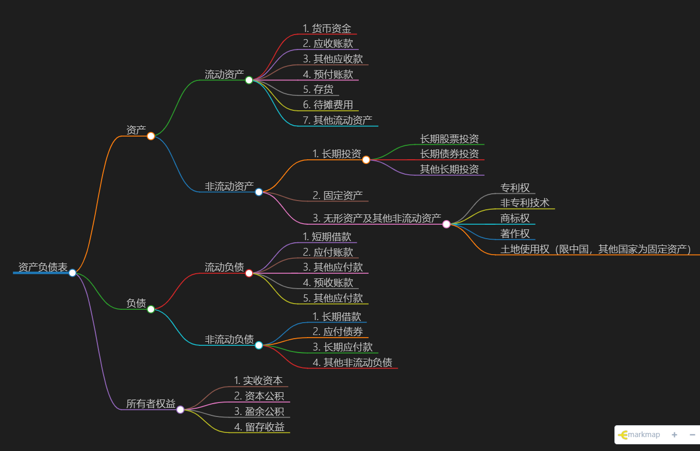
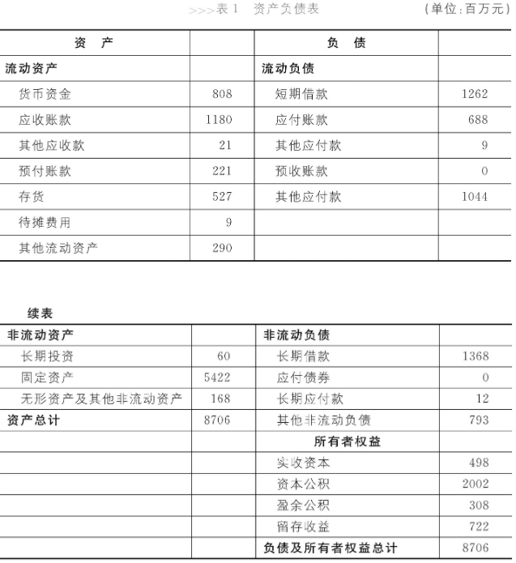

# 资产负债表

##  1. 企业活动

+ 经营

+ 投资

+ 融资

  ```mermaid
  graph LR
  A[企业]-->B[经营:生产 销售产品 回收货款等]
  A[企业]-->C[投资:开展新业务 生产新产品等]
  A[企业]-->D[融资:经营投资过程缺钱 银行贷款 找人投资]
  ```

  ```mermaid
  graph LR
  A[现金]-->B[注册公司]-->E[建厂房 进设备 招人 买材料]-->C[经营生产产品]-->D[销售产品]-->A
  ```

  ```mermaid
  graph LR
  A1[现金:银行贷款 找人投资]-->E1[扩建厂房 进设备 招人 买材料]-->C1[生产设计新产品]-->D1[销售产品]-->A1
  ```

  ```mermaid
  graph LR
  A[经营]-->B[投资]-->C[融资]-->A
  ```

  总结：

  企业日常经济活动可以抽象成，从现金开始，转一圈后又回到现金的过程。循环往复，在此过程中，经营，投资，融资三项活动交替进行，也在循环往复。

##  2. 资产负债表 意义

描述：表示企业有什么——本金现在都成了什么，目前价值如何？

### 包括内容

### 例子
+ 左边 资产
+ 右边 负责、股东权益



### 流动资产

+ 货币资金（crash）

  - 库存现金
  - 银行存款
  - 其他货币资金
  以上三个项目的期末余额，具有专门用的货币资金除外
  
 + 应收账款(Account Receivable) 
 
	-  核算企业因销售商品、提供劳务等经营活的应收取的款项    
	
+ 其他应收款(Other Receivable) 
		
	-   企业除存出保证金(如租房子时交付的未来将退回的保证金、押金等)、买入返售金融资产、应收票据、应收账款、预付账款、应收股利、应收利息、应收代位追偿款、应收分保账款、应收分保合同准备金、长期应收款等以外的其他各种应收及暂付款项。
	-   例如，借个其他公司借款，借给员工备用金等
	-   企业跟其他方关联交易，关联方“借走了”该项资金。这里的借其实是一种拿，因此这笔钱又被称为 占用资金
	
+ 预付账款（Prepaid Accounts 企业按照合同规定预付的款项
+ 存货 生产产品所需的原材料，生产出来的产品，及尚处在生产中的产品
	- 在产品(work in process) 在加工
	- 产成品(Finished Goods)完成全部征税且已验收入口合乎标准规格和技术条件
	
	```mermaid
	graph LR
		A[存货Inventory]-->B[在产品]
		A-->C[产成品]
		A-->D[材料&物料]
	```
	 
+ 待摊费用
	- 资产和费用之间有个很大的共同之处，就是都花钱。如果这笔钱可以换来一个对将来有用的东西，那就是资产。如果这笔钱花完了，他就是费用。 
	- 最初是笔资产，但随着时间的的推移与企业的运转，最终变成了一笔费用，这就叫待摊费用。

+ 流动资产（Current Assets） 指企业可以在1年货超过1年的一个营业周期内变现或者运用的资产


货币资金，应收账款、其他应收款，预付账款，存货都是企业的流动资产。各项流动资产在资产负债表中是按照他们的各自转换成现金的速度来排序的。

流动资产能很快的完成从现金开始又回到现金的过程。而非流动资产则需要漫长的过程。 

+ 非流动资产（Non-Current Assets）指流动资产以外的资产。
	- 长期投资(Long-term Investments）指不满足短期投资条件的投资，即不准备在一年或长于一年的经营周期之内转杯为现金的投资。
		+ 长期股票投资
		+ 长期债券投资
		+ 其他长期投资
	- 固定资产 (Fixed Assets)：指同时具有 1-为生产商品、提供劳务、出租或经营管理而持有的；2 使用寿命超过一个会计年度。
		+ 固定资产的折旧（Depreciation):指一定时期内为弥补固定资产损耗按照规定的固定资产折旧率提取的固定资产折旧，或按国民经济核算同意规定的折旧率虚拟计算的固定资产折旧。
+ 无形资产(Intangible Assets and Other Assets)：指企业拥有或者控制的没有实物形态的可辨认非货币性资产
	- 专利权
	- 非专利技术
	- 商标权
	- 著作权
	- 土地使用权（Land Usage Rights）国家机关、企事业单位、农民集体和公民个人，以及三资企业，凡是具备法定条件者，依照法定程序或依约定对国有土地或农民集体土地所享有的占有、利用、收益和有限处分的权利
	以上适用于中国，因为其他国家企业和个人是可以拥有土地所有权的，这种情况下土地是固定资产。

