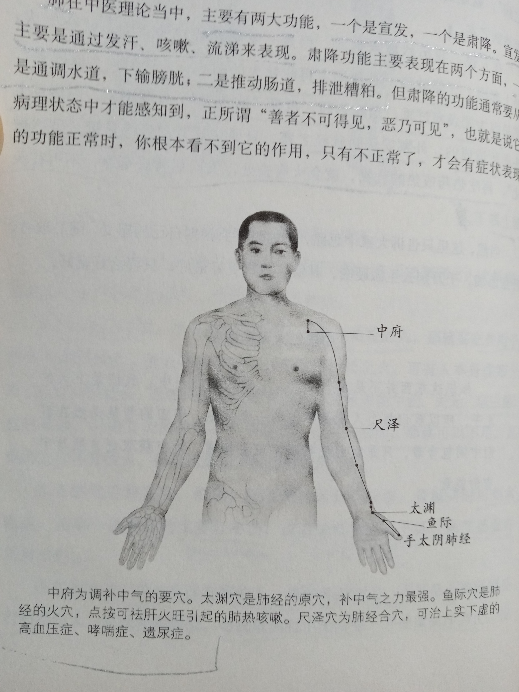

肺属金,秋天肺气最旺,功能最强,可借天时以养肺.

肺在中医理论当中，主要有两大功能，一个是宣发，一个是肃降。宣发主要是通过发汗、咳嗽、流涕来表现。肃降功能主要表现在两个方面，是通调水道，下输膀胱：二是推动肠道，排泄糟粕。但肃降的功能通常要从病理状态中才能感知到，正所谓“善者不可得见，恶乃可见”，也就是说它的功能正常时，你根本看不到它的作用，只有不正常了，才会有症状表现.

中府为调补中气的要穴。太渊穴是肺经的原穴，补中气之力最强。鱼际穴是肺经的火穴，点按可祛肝火旺引起的肺热咳嗽。尺泽穴为肺经合穴，可治上实下虚的高血压症、哮喘症、遗尿症。