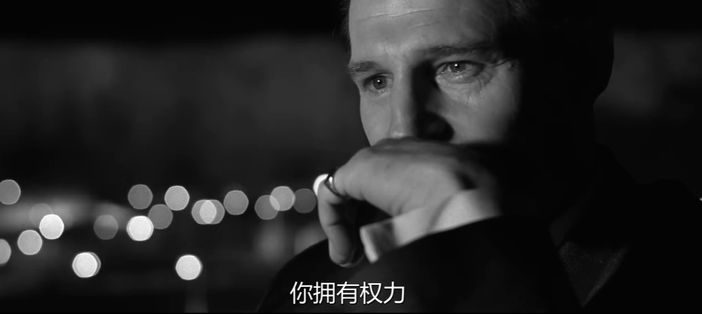
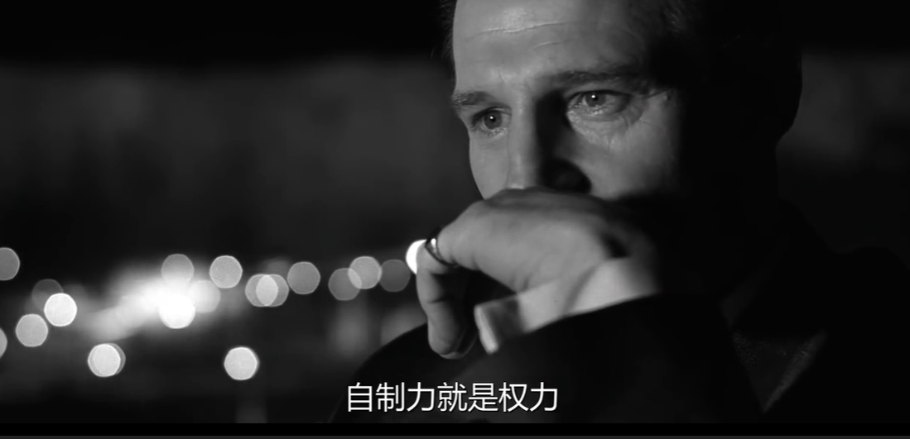
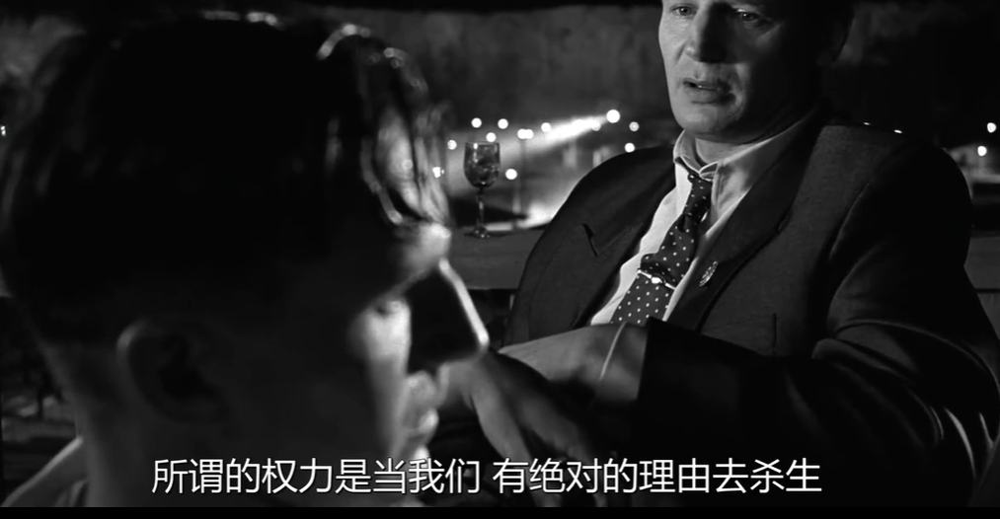
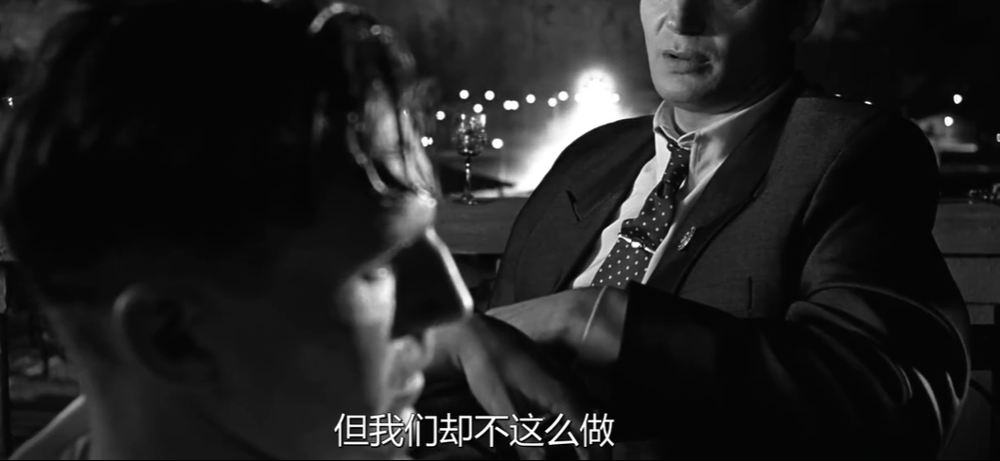

不能在人生的下一个阶段共同成长

“不能在人生的下一个阶段共同成长”。说实话真不知道，都到那个份儿上了，还需要怎样的成长？也许是贫穷限制了我的想象。

其实也没什么想象的。不过是个破裂理由。但是这个理由不是给自己的，也不是给对方的。仅仅是给别人看的。因为彼此双方都知道什么才是真正的原因。

感觉有点想岛国动作动漫，即便是污秽不堪，也能给出或者励志或者光明正大的理由。 

其实任何人脱不了原始低级趣味的吸引，那是原始的本能。手握权柄且书画金石艺术都非常有造诣的宋徽宗，在书画之余不也偷偷的去找李师师吗？虽然是佳丽三千。又怎样？道君皇帝与李师师的缱绻情话，当年周邦彦在李师师床底下可是都听到了。还写下来了，看这《少年游》

并刀如水，吴盐胜雪，纤手破新橙。

锦幄初温，兽香不断，相对坐调笙。

低声问：向谁行宿？城上已三更。

马滑霜浓，不如休去，直是少人行！

翻译成人话就这一副场景：美女纤纤玉手，轻轻剥好新下来的橙子，然后跟道君皇帝一起吃，很有可能是你一瓣我一瓣的吃，也有可能是你一半我一半的吃。注意这个瓣与半的区别，具体情景可以自己脑补。吃完水果，燃香温被，一起听听音乐，kk歌。情调都上来了，道君皇帝说，时间不早了，我明天还有很多事情要处理，我得走了。于是假装要走。美女说话了，都三更天了，还上哪里去休息？再说外币爱你天冷路滑的，还是在这里别走了。你看你看，别人都休息了，哪里还有人走动？在这睡吧 ……后面脑补。

就是可怜了周大才子。
从古到今，男人对待女人的总是一如既往专一，那就是都喜欢年轻且漂亮的。那爱显呗的乾隆看着内弟媳妇漂亮，老根八尺的插了一杠子。有权，有钱，保暖思淫欲。鲁迅先生为啥大冷的冬天只穿一条单裤？郁达夫在《回忆鲁迅》一文中说：经常在冷的天，见到鲁迅穿着单裤，那时的鲁迅正过着事实上的单身生活，也不怕着凉，原来他这样做是为了降低性欲。

好吧。

想起《辛德勒的名单》里主人公说的话，如图

虽然某些人有权利，但是却更有自制力，不恣意妄为，那才是风范……

